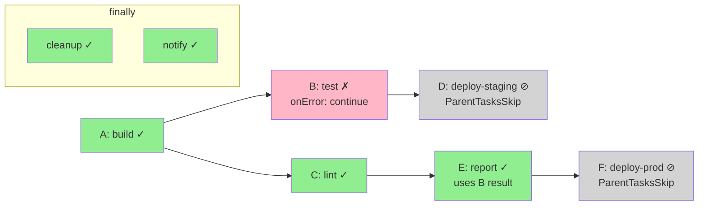
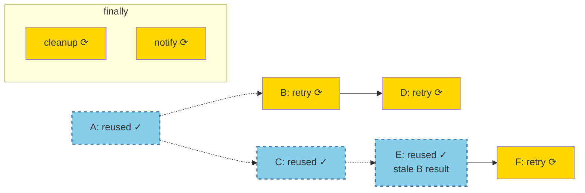

# Partial PipelineRun Retry — Design Proposal

> **Document Type:** Design Proposal & Evaluation 
> **Status:** Work in Progress 
> **Last Updated:** 2026-09-22 
> **Jira Epic:** [SRVKP-14121](https://redhat.atlassian.net/browse/SRVKP-14121)

---

## Purpose

This document proposes specific design decisions and implementation approaches for partial PipelineRun retry functionality in Tekton Pipelines. It builds on the technical foundation established in `research/architecture-analysis.md`.

**Scope:** 
- Failed subgraph computation rules
- Result re-injection (memoization) mechanisms
- Retry planning boundary evaluation (controller vs. client-side)
- Workspace/PVC handling strategies
- Pipeline definition stability approaches
- Data availability strategies (pruning, Tekton Results integration)
- API shape, security, and provenance requirements

**Prerequisites:** 
- Read `research/architecture-analysis.md` first (Parts 1-4)
- Familiarity with `research/adr-new-object-model.md` (decision to use new PipelineRun per retry)

---

## Table of Contents

1. [Part 5 — Design: Failed Subgraph Computation Rules](#part-5--design-failed-subgraph-computation-rules)
2. [Part 6 — Design: Result Re-injection (Memoization)](#part-6--design-result-re-injection-memoization)
3. [Part 7 — Design Evaluation: Retry Planning Boundary](#part-7--design-evaluation-retry-planning-boundary)
4. [Part 8 — Design Evaluation: Workspace PVC Handling](#part-8--design-evaluation-workspace-pvc-handling)
5. [Part 9 — Design Evaluation: Pipeline Definition Stability](#part-9--design-evaluation-pipeline-definition-stability)
6. [Part 10 — Design Evaluation: Data Availability Strategies](#part-10--design-evaluation-data-availability-strategies)
7. [Part 11 — Design Evaluation: API Shape, Security & Provenance](#part-11--design-evaluation-api-shape-security--provenance)

---

## Part 5 — Design: Failed Subgraph Computation Rules

### 5.1 Subgraph Computation Rules

The retry subset is determined by applying the following rules to the original `PipelineRunFacts` to compute which DAG tasks to re-run and which to bypass.

1. **Explicit Failures, Cancellations & Interrupted Tasks (The Roots):** 
   Any DAG task whose run object meets one of the following conditions is added to the re-run set:
   
   **a) Terminal failure:** `Condition{Type: Succeeded, Status: False}` in its status. 
   This includes `Failed`, `Cancelled`, `TaskRunTimeout`, `PipelineRunTimeout`, and infrastructure 
   errors (e.g., `ImagePullBackOff`, `OOMKilled`).
   
   **b) Interrupted mid-flight:** Task does not have `Condition{Type: Succeeded, Status: True}` 
   **and** the `PipelineRun` was stopped (cancelled, timed out, or gracefully stopped) before the 
   task could reach a terminal state.
2. **Skip Cascades (The Victims):** Any DAG task that was skipped due to a downstream cascade from a failure must be re-run.
This includes tasks with `SkippingReason` set to `ParentTasksSkip`, `StoppingSkip`, `MissingResultsSkip`, `PipelineRunTimeoutSkip`, or `GracefullyStoppedSkip`.
3. **Intentional Skips (The Bypasses):** Tasks skipped with `WhenExpressionsSkip` made a deliberate conditional decision and are **excluded** from the re-run set. In the new `PipelineRun`, their `WhenExpressions` will be re-evaluated naturally against the new context.
4. **`onError: continue` Resolution:** 
    *   **The failed task itself:** Always included in the re-run set, regardless of the pipeline's configured tolerance for it.
    *   **Scenario A (Upstream failed, emitted result, downstream succeeded):** Downstream tasks are **excluded** from the re-run set. 
    *Tradeoff:* If the retried upstream task emits a different result value, the downstream task's previously successful output becomes stale and inconsistent. This risk is accepted for v1 to align with CI/CD immutability norms.
    *   **Scenario B (Upstream failed, no result, downstream ValidationFailed):** The downstream task is **included** in the re-run set, as it functionally never ran because it lacked required inputs .
    *   **Scenario C (Upstream failed with onError: continue, downstream has ordering-only dependency via runAfter):** 
    If the downstream task depends on the upstream via `runAfter` but does NOT reference any of its results, 
    and the downstream task **succeeded** in the original run, it is **excluded** from the re-run set.
    *Rationale:* The downstream's execution was valid even though the upstream failed — it only required 
    ordering guarantees, not data outputs. Re-running it would duplicate valid work.
5. **Matrix Granularity (Policy B):** For v1, if any combination within a `matrix` task fails, **all N combinations** are included in the re-run set.
The entire task's `ChildReferences` are removed and re-fanned out by the controller .
6. **Finally Tasks:** Finally tasks are **excluded** from the failed subgraph calculation. Because the retry is a new `PipelineRun` object, all finally tasks execute fresh automatically after the retry's DAG phase completes.
This ensures cleanup and notification logic accurately reflects the retry's outcome, rather than preserving the original run's state. 
7. **Custom Tasks (`CustomRun`):** Apply the same terminal state rules to `CustomRun.Status.Conditions` as built-in tasks . For v1, treat the `CustomRun` as an atomic unit;
the reconciler will not recurse into nested external controllers to retry partial custom state.
8. **Nested PipelineRuns:** Apply the same terminal state rules to the child `PipelineRun.Status.Conditions`. For v1, the child `PipelineRun` is treated as an atomic unit. If a child pipeline fails, the entire nested pipeline is re-run;
the partial retry logic does not recursively traverse down into the nested DAG.
9. **Task-Level Retries (Fresh Retry Budget):** Each retry `PipelineRun` is a new execution context. 
   Tasks with `taskSpec.retries` or `taskRef.retries` get their **full retry budget reset** in the new `PipelineRun`.
   

### 5.2 Example: Failed Subgraph Computation

**Original Pipeline Execution:**

                
**Task States:**
- **A** : ✓ Succeeded
- **B** : ✗ Failed (onError: continue)
- **C** : ✓ Succeeded
- **D** : ⊘ Skipped (ParentTasksSkip - runAfter B)
- **E** : ✓ Succeeded (used B's result despite failure)
- **F** : ⊘ Skipped (ParentTasksSkip - depends on D)
- **cleanup**: ✓ Succeeded (finally)
- **notify**: ✓ Succeeded (finally)

**Failed Subgraph Analysis:**

| Task | Reason | Re-run? |
|------|--------|---------|
| **A** | Succeeded, no downstream failures | ✗ **Bypass** (reuse results) |
| **B** | Explicit failure (Rule 1) | ✓ **Re-run** |
| **C** | Succeeded, independent branch | ✗ **Bypass** (reuse results) |
| **D** | ParentTasksSkip cascade (Rule 2) | ✓ **Re-run** |
| **E** | Succeeded, referenced B's result (Rule 4, Scenario A) | ✗ **Bypass** (accept staleness risk) |
| **F** | ParentTasksSkip cascade (Rule 2) | ✓ **Re-run** |
| **cleanup** | Finally task (Rule 6) | ✓ **Re-run fresh** (automatic) |
| **notify** | Finally task (Rule 6) | ✓ **Re-run fresh** (automatic) |

**Retry Execution:**

**Legend:**
- 🟢 **Green (solid)**: Succeeded in original run
- 🔴 **Pink**: Failed in original run
- ⚪ **Gray**: Skipped (cascade)
- 🔵 **Blue (dashed)**: Reused in retry
- 🟡 **Yellow**: Re-executed in retry
                    

**Key Observations:**
- **Failed subgraph:** B, D, F (3 tasks)
- **Reused:** A, C, E (3 tasks)
- **Finally tasks:** Always run fresh, not part of subgraph calculation
- **E uses stale data:** Acceptable tradeoff for v1 (Rule 4, Scenario A)

### 5.3 Edge Cases & Validation

**Edge Case 1: All DAG tasks failed**
- **Subgraph:** Entire DAG
- **Behavior:** Equivalent to a full pipeline retry, but preserves lineage metadata and retry count
- **Action:** Accept the retry request

**Edge Case 2: Only finally tasks failed**
- **Subgraph:** Empty (no DAG tasks to retry)
- **Behavior:** Finally tasks run after DAG completion; retrying them in isolation is ambiguous
- **Action:** For v1, **reject** the retry request with error: "Cannot retry: only finally tasks failed. 
  Finally-only retry requires manual intervention or full pipeline rerun."
- **Future Work:** Phase 2 could support finally-only retry with explicit user confirmation

**Edge Case 3: Mixed error policies (stopAndFail + continue)**
- **Subgraph:** Compute independently per branch
- **Behavior:** A `stopAndFail` task failure creates `StoppingSkip` cascades (always re-run). 
  An `onError: continue` task failure in a different branch follows Rule 4 scenarios.
- **Action:** Apply rules 1-4 consistently regardless of other branches' error policies

**Edge Case 4: WhenExpressions re-evaluation changes outcome**
- **Original:** Task skipped with `WhenExpressionsSkip`
- **Retry:** When re-evaluates to `true` (e.g., param changed, time-based condition)
- **Behavior:** Task was intentionally skipped before (Rule 3), but condition now passes
- **Action:** Task **will execute** in retry. This is correct behavior — When conditions are dynamic.
- **User Warning:** CLI/UI should warn if re-evaluation may change skip decisions

**Edge Case 5: Manual TaskRun deletion**
- **Original:** User manually deleted a succeeded TaskRun before retry
- **Subgraph:** Would exclude it (Rule: succeeded tasks bypassed)
- **Behavior:** Result data unavailable for downstream tasks
- **Action:** Pre-flight validation detects missing TaskRun, rejects retry with error: 
  "Cannot retry: TaskRun for bypassed task 'X' was deleted. Required results unavailable."

**Edge Case 6: Nested pipeline partial failure**
- **Original:** Child PipelineRun has internal partial failure
- **Subgraph:** Treats child PipelineRun as atomic (Rule 8)
- **Behavior:** Entire child pipeline re-runs; does not compute subgraph within nested DAG
- **Action:** For v1, accept this limitation. Warn user that nested pipelines retry fully.
- **Future Work:** Recursive subgraph computation for nested pipelines

## Related Documents

- **Architecture Research:** `research/architecture-analysis.md` (Parts 1-4)
- **Prior Art Analysis:** `research/prior-art-analysis.md`
- **Architecture Decision Record:** `research/adr-new-object-model.md`
