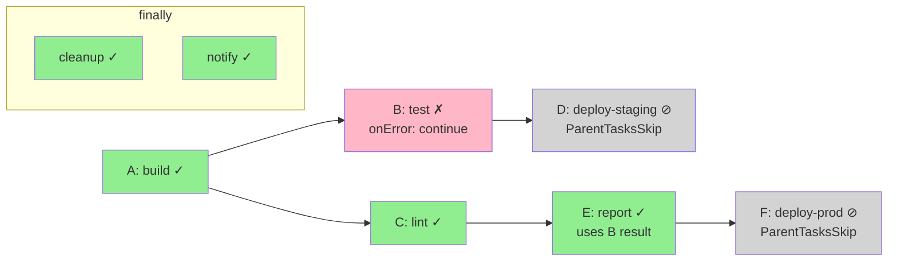
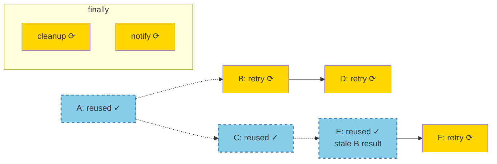

# Partial PipelineRun Retry — Design Proposal

> **Document Type:** Design Proposal & Evaluation 
> **Status:** Work in Progress 
> **Last Updated:** 2026-09-22 
> **Jira Epic:** [SRVKP-14121](https://redhat.atlassian.net/browse/SRVKP-14121)

---

## Purpose

This document proposes specific design decisions and implementation approaches for partial PipelineRun retry functionality in Tekton Pipelines. It builds on the technical foundation established in `research/architecture-analysis.md`.

**Scope:** 
- Failed subgraph computation rules
- Result re-injection (memoization) mechanisms
- Retry planning boundary evaluation (controller vs. client-side)
- Workspace/PVC handling strategies
- Pipeline definition stability approaches
- Data availability strategies (pruning, Tekton Results integration)
- API shape, security, and provenance requirements

**Prerequisites:** 
- Read `research/architecture-analysis.md` first (Parts 1-4)
- Familiarity with `research/adr-new-object-model.md` (decision to use new PipelineRun per retry)

---

## Table of Contents

1. [Part 5 — Design: Failed Subgraph Computation Rules](#part-5--design-failed-subgraph-computation-rules)
2. [Part 6 — Design: Result Re-injection (Memoization)](#part-6--design-result-re-injection-memoization)
3. [Part 7 — Design Evaluation: Retry Planning Boundary](#part-7--design-evaluation-retry-planning-boundary)
4. [Part 8 — Design Evaluation: Workspace PVC Handling](#part-8--design-evaluation-workspace-pvc-handling)
5. [Part 9 — Design Evaluation: Pipeline Definition Stability](#part-9--design-evaluation-pipeline-definition-stability)
6. [Part 10 — Design Evaluation: Data Availability Strategies](#part-10--design-evaluation-data-availability-strategies)
7. [Part 11 — Design Evaluation: API Shape, Security & Provenance](#part-11--design-evaluation-api-shape-security--provenance)

---

## Part 5 — Design: Failed Subgraph Computation Rules

### 5.1 Subgraph Computation Rules

The retry subset is determined by applying the following rules to the original `PipelineRunFacts` to compute which DAG tasks to re-run and which to bypass.

1. **Explicit Failures, Cancellations & Interrupted Tasks (The Roots):** 
   Any DAG task whose run object meets one of the following conditions is added to the re-run set:
   
   **a) Terminal failure:** `Condition{Type: Succeeded, Status: False}` in its status. 
   This includes `Failed`, `Cancelled`, `TaskRunTimeout`, `PipelineRunTimeout`, and infrastructure 
   errors (e.g., `ImagePullBackOff`, `OOMKilled`).
   
   **b) Interrupted mid-flight:** Task does not have `Condition{Type: Succeeded, Status: True}` 
   **and** the `PipelineRun` was stopped (cancelled, timed out, or gracefully stopped) before the 
   task could reach a terminal state.
2. **Skip Cascades (The Victims):** Any DAG task that was skipped due to a downstream cascade from a failure must be re-run.
This includes tasks with `SkippingReason` set to `ParentTasksSkip`, `StoppingSkip`, `MissingResultsSkip`, `PipelineRunTimeoutSkip`, or `GracefullyStoppedSkip`.
3. **Intentional Skips (The Bypasses):** Tasks skipped with `WhenExpressionsSkip` made a deliberate conditional decision and are **excluded** from the re-run set. In the new `PipelineRun`, their `WhenExpressions` will be re-evaluated naturally against the new context.
4. **`onError: continue` Resolution:** 
    *   **The failed task itself:** Always included in the re-run set, regardless of the pipeline's configured tolerance for it.
    *   **Scenario A (Upstream failed, emitted result, downstream succeeded):** Downstream tasks are **excluded** from the re-run set. 
    *Tradeoff:* If the retried upstream task emits a different result value, the downstream task's previously successful output becomes stale and inconsistent. This risk is accepted for v1 to align with CI/CD immutability norms.
    *   **Scenario B (Upstream failed, no result, downstream ValidationFailed):** The downstream task is **included** in the re-run set, as it functionally never ran because it lacked required inputs .
    *   **Scenario C (Upstream failed with onError: continue, downstream has ordering-only dependency via runAfter):** 
    If the downstream task depends on the upstream via `runAfter` but does NOT reference any of its results, 
    and the downstream task **succeeded** in the original run, it is **excluded** from the re-run set.
    *Rationale:* The downstream's execution was valid even though the upstream failed — it only required 
    ordering guarantees, not data outputs. Re-running it would duplicate valid work.
5. **Matrix Granularity (Policy B):** For v1, if any combination within a `matrix` task fails, **all N combinations** are included in the re-run set.
The entire task's `ChildReferences` are removed and re-fanned out by the controller .
6. **Finally Tasks:** Finally tasks are **excluded** from the failed subgraph calculation. Because the retry is a new `PipelineRun` object, all finally tasks execute fresh automatically after the retry's DAG phase completes.
This ensures cleanup and notification logic accurately reflects the retry's outcome, rather than preserving the original run's state. 
7. **Custom Tasks (`CustomRun`):** Apply the same terminal state rules to `CustomRun.Status.Conditions` as built-in tasks . For v1, treat the `CustomRun` as an atomic unit;
the reconciler will not recurse into nested external controllers to retry partial custom state.
8. **Nested PipelineRuns:** Apply the same terminal state rules to the child `PipelineRun.Status.Conditions`. For v1, the child `PipelineRun` is treated as an atomic unit. If a child pipeline fails, the entire nested pipeline is re-run;
the partial retry logic does not recursively traverse down into the nested DAG.
9. **Task-Level Retries (Fresh Retry Budget):** Each retry `PipelineRun` is a new execution context. 
   Tasks with `taskSpec.retries` or `taskRef.retries` get their **full retry budget reset** in the new `PipelineRun`.
   

### 5.2 Example: Failed Subgraph Computation

**Original Pipeline Execution:**


                
**Task States:**
- **A** : ✓ Succeeded
- **B** : ✗ Failed (onError: continue)
- **C** : ✓ Succeeded
- **D** : ⊘ Skipped (ParentTasksSkip - runAfter B)
- **E** : ✓ Succeeded (used B's result despite failure)
- **F** : ⊘ Skipped (ParentTasksSkip - depends on D)
- **cleanup**: ✓ Succeeded (finally)
- **notify**: ✓ Succeeded (finally)

**Failed Subgraph Analysis:**

| Task | Reason | Re-run? |
|------|--------|---------|
| **A** | Succeeded, no downstream failures | ✗ **Bypass** (reuse results) |
| **B** | Explicit failure (Rule 1) | ✓ **Re-run** |
| **C** | Succeeded, independent branch | ✗ **Bypass** (reuse results) |
| **D** | ParentTasksSkip cascade (Rule 2) | ✓ **Re-run** |
| **E** | Succeeded, referenced B's result (Rule 4, Scenario A) | ✗ **Bypass** (accept staleness risk) |
| **F** | ParentTasksSkip cascade (Rule 2) | ✓ **Re-run** |
| **cleanup** | Finally task (Rule 6) | ✓ **Re-run fresh** (automatic) |
| **notify** | Finally task (Rule 6) | ✓ **Re-run fresh** (automatic) |

**Retry Execution:**



**Legend:**
- 🟢 **Green (solid)**: Succeeded in original run
- 🔴 **Pink**: Failed in original run
- ⚪ **Gray**: Skipped (cascade)
- 🔵 **Blue (dashed)**: Reused in retry
- 🟡 **Yellow**: Re-executed in retry
                    

**Key Observations:**
- **Failed subgraph:** B, D, F (3 tasks)
- **Reused:** A, C, E (3 tasks)
- **Finally tasks:** Always run fresh, not part of subgraph calculation
- **E uses stale data:** Acceptable tradeoff for v1 (Rule 4, Scenario A)

### 5.3 Edge Cases & Validation

**Edge Case 1: All DAG tasks failed**
- **Subgraph:** Entire DAG
- **Behavior:** Equivalent to a full pipeline retry, but preserves lineage metadata and retry count
- **Action:** Accept the retry request

**Edge Case 2: Only finally tasks failed**
- **Subgraph:** Empty (no DAG tasks to retry)
- **Behavior:** Finally tasks run after DAG completion; retrying them in isolation is ambiguous
- **Action:** For v1, **reject** the retry request with error: "Cannot retry: only finally tasks failed. 
  Finally-only retry requires manual intervention or full pipeline rerun."
- **Future Work:** Phase 2 could support finally-only retry with explicit user confirmation

**Edge Case 3: Mixed error policies (stopAndFail + continue)**
- **Subgraph:** Compute independently per branch
- **Behavior:** A `stopAndFail` task failure creates `StoppingSkip` cascades (always re-run). 
  An `onError: continue` task failure in a different branch follows Rule 4 scenarios.
- **Action:** Apply rules 1-4 consistently regardless of other branches' error policies

**Edge Case 4: WhenExpressions re-evaluation changes outcome**
- **Original:** Task skipped with `WhenExpressionsSkip`
- **Retry:** When re-evaluates to `true` (e.g., param changed, time-based condition)
- **Behavior:** Task was intentionally skipped before (Rule 3), but condition now passes
- **Action:** Task **will execute** in retry. This is correct behavior — When conditions are dynamic.
- **User Warning:** CLI/UI should warn if re-evaluation may change skip decisions

**Edge Case 5: Manual TaskRun deletion**
- **Original:** User manually deleted a succeeded TaskRun before retry
- **Subgraph:** Would exclude it (Rule: succeeded tasks bypassed)
- **Behavior:** Result data unavailable for downstream tasks
- **Action:** Pre-flight validation detects missing TaskRun, rejects retry with error: 
  "Cannot retry: TaskRun for bypassed task 'X' was deleted. Required results unavailable."

**Edge Case 6: Nested pipeline partial failure**
- **Original:** Child PipelineRun has internal partial failure
- **Subgraph:** Treats child PipelineRun as atomic (Rule 8)
- **Behavior:** Entire child pipeline re-runs; does not compute subgraph within nested DAG
- **Action:** For v1, accept this limitation. Warn user that nested pipelines retry fully.
- **Future Work:** Recursive subgraph computation for nested pipelines


## Part 6 — Design: Result Re-injection (Memoization)

*Status: In Progress - Story SRVKP-14275*

---

## Part 7 — Design Evaluation: Retry Planning Boundary

### 7.1 The Core Question

When a user requests a retry, **who calculates which tasks to re-run**? Two fundamental approaches exist:

**Option A — Controller/API calculates (server-side):**
- User calls API endpoint: `POST /apis/tekton.dev/v1/namespaces/default/pipelineruns/pr-123/retry`
- Controller reads original PipelineRun/TaskRuns, computes failed subgraph, creates new PipelineRun with injected state
- Clients (tkn, Dashboard, Console) are thin wrappers around the API call

**Option B — Client calculates (client-side orchestration):**
- User runs `tkn pipelinerun retry pr-123`
- CLI reads K8s objects, computes failed subgraph, extracts results, generates new PipelineRun YAML
- CLI applies the YAML to cluster
- Controller reconciles it normally (no special "retry mode")

---

### 7.2 Option A: Controller/API Calculates

**Implementation approach:**
- New API endpoint or webhook: `/retry` subresource on PipelineRun
- Controller grows a retry path in `ReconcileKind()` or a separate retry controller
- Retry-specific admission validation

**Benefits:**
- **Centralized logic:** All clients get identical retry behavior
- **Consistent** across tkn, Dashboard, Console - no risk of divergent implementations
- **Simpler client code:** Just make API call, don't implement complex graph traversal
- **Server-side validation:** Controller validates PVC availability, result availability before creating retry
- **Easier to update:** Fix a bug once in controller, all clients benefit immediately

**Drawbacks:**
- **Controller complexity:** Adds new code path to already complex PipelineRun reconciler
- **New API surface:** Requires designing/versioning a retry API (breaking change risk)
- **Testing overhead:** Must test controller retry path in isolation from normal reconcile
- **Tight coupling:** Retry logic embedded in controller lifecycle (harder to maintain separately)
- **Does not align with K8s patterns:** Most K8s operations are declarative (apply YAML), not imperative (call endpoint)

---

### 7.3 Option B: Client Calculates

**Implementation approach:**
- Shared library `pkg/retry` in tektoncd/pipeline repo
- Exported functions: `ComputeFailedSubgraph()`, `ExtractResults()`, `GenerateRetryPipelineRun()`
- tkn, Dashboard, Console import the library
- Controller unchanged (no retry-specific logic)

**Benefits:**
- **Simpler controller:** No new code paths, just normal reconcile
- **Declarative model:** Retry is "apply new PipelineRun YAML" (fits K8s paradigm)
- **Separation of concerns:** Retry planning separate from runtime execution
- **Easier to prototype:** Can implement `tkn retry` without touching controller
- **Lower risk:** Controller doesn't change, existing behavior unaffected
- **Matches prior art:** Argo Workflows uses client-side (`argo retry` CLI computes, controller reconciles)

**Drawbacks:**
- **Duplication risk:** Each client could reimplement logic independently (if library not used)
- **Shared library required:** Must maintain `pkg/retry` with stable API
- **Version skew:** Client library version might not match controller version
- **Client must understand Tekton internals:** Graph traversal, result propagation, skip reasons

---

### 7.4 Prior Art Comparison

| System | K8s-Native? | Retry Orchestration | Notes |
|--------|-------------|---------------------|-------|
| **Argo Workflows** | ✓ Yes | **Client-side** | `argo retry` CLI computes memoized state, generates new Workflow YAML, applies it |
| **GitHub Actions** | ✗ No (SaaS) | Server-side | API endpoint handles retry planning |
| **GitLab CI** | ✗ No (SaaS) | Server-side | Backend recalculates pipeline state |
| **CircleCI** | ✗ No (SaaS) | Server-side | API-driven retry |
| **Jenkins** | ✗ No (pre-K8s) | Server-side | Master (controller) handles restart-from-stage |

**Key insight:** The only Kubernetes-native system (Argo) uses **client-side orchestration**. SaaS systems use server-side, but they're not constrained by CRD immutability or K8s declarative patterns.

---

### 7.4.1 Evaluation Against Key Criteria

| Criterion | Option A (Controller) | Option B (Client) | Winner |
|-----------|----------------------|-------------------|--------|
| **Code Duplication** | ✓ Logic in one place (controller) |  Requires shared library to avoid duplication across tkn/Dashboard/Console | **A** |
| **Performance & Repeated Calculations** | ✓ Calculated once, cached in API response | ✗ Each client recalculates (CLI + Dashboard preview + Console UI = 3x work) | **A** |
| **Consistency Across Clients** | ✓ All clients get identical results |  Risk of version skew between client library versions | **A** |
| **API Complexity** | ✗ New API endpoint, versioning, breaking change risk | ✓ No API changes, uses existing create PipelineRun | **B** |
| **Debugging** |  Server-side logic harder to inspect | ✓ Client generates YAML, users can inspect before apply | **B** |
| **Transparency** | ✗ Retry plan hidden in API call | ✓ Generated PipelineRun YAML shows exactly what will run | **B** |

**Score: Option A wins 3/6 criteria, but wins on the most critical ones (performance, consistency, code duplication)**

---

### 7.4.2 Performance Analysis: Repeated Calculations

**Scenario:** User wants to retry a failed PipelineRun with 50 tasks, 10 failed.

#### Option B (Client-side): Work is Duplicated

1. **User runs CLI:** `tkn pipelinerun retry pr-123` → **Calculation #1**
2. **User opens Dashboard to preview retry plan** → **Calculation #2** (duplicates same work)
3. **User checks OpenShift Console to verify** → **Calculation #3** (duplicates same work)
4. **CI system auto-retry script validates retry** → **Calculation #4** (duplicates same work)

**Each calculation requires:**
- Fetch PipelineRun from K8s API (1 call)
- Fetch 50 TaskRuns from K8s API (50 calls)
- Parse DAG dependencies from Pipeline spec
- Compute failed subgraph (graph traversal)
- Extract results from 40 succeeded TaskRuns
- Validate result availability
- Generate new PipelineRun YAML

**Total work:** 4 calculations × 51 K8s API calls = **204 API calls** 
**CPU cost:** 4× subgraph computation, 4× result extraction

---

#### Option A (Controller-side): Work Calculated Once

1. **Any client calls:** `POST .../pipelineruns/pr-123/retry` → **Calculation #1** (server-side)
   - Controller computes failed subgraph
   - Controller caches result for 5 minutes (or until PR state changes)
2. **All subsequent clients** (tkn, Dashboard, Console, CI scripts) get **cached plan** → **0 recalculations**

**Total work:** 1 calculation × 51 K8s API calls = **51 API calls** 
**CPU cost:** 1× subgraph computation, 1× result extraction

---

**Verdict:** 
- **Option A is 4× more efficient** for multi-client scenarios
- **Reduces K8s API load** by 75% (204 calls → 51 calls)
- **Critical for large pipelines** (100+ tasks = 400+ API calls saved)

---

### 7.4.3 Security & RBAC Considerations

#### Option A (Controller/API)

**RBAC Model:**
```yaml
apiVersion: rbac.authorization.k8s.io/v1
kind: Role
rules:
  - apiGroups: ["tekton.dev"]
    resources: ["pipelineruns/retry"]  # NEW subresource
    verbs: ["create"]
```

**Security Properties:**
- **Fine-grained control:** Can grant retry permission separately from create/delete
- **Audit trail:** All retry requests logged server-side with user identity
- **Policy enforcement:** Controller can enforce org policies (e.g., "no retries in prod namespace after 5pm")
- **Immutable retry plan:** Server calculates plan, user cannot tamper with subgraph
- **New attack surface:** `/retry` endpoint is new code path to secure

**Example policy enforcement:**
```go
// Controller can block retries based on namespace, time, user, etc.
if pr.Namespace == "production" && time.Now().Hour() >= 17 {
    return errors.New("production retries blocked outside business hours")
}
```

---

#### Option B (Client-side)

**RBAC Model:**
```yaml
apiVersion: rbac.authorization.k8s.io/v1
kind: Role
rules:
  - apiGroups: ["tekton.dev"]
    resources: ["pipelineruns"]
    verbs: ["get"]        # Read original PR
  - apiGroups: ["tekton.dev"]
    resources: ["pipelineruns"]
    verbs: ["create"]     # Create retry PR (no special permission)
```

**Security Properties:**
- **No new attack surface:** Uses existing create permission
- **Existing RBAC:** Reuses well-tested permission model
- **No retry-specific audit:** Can't distinguish retry from new run in audit logs
- **No policy enforcement:** Client-side validation can be bypassed by crafting YAML manually
- **Coarse-grained:** If user can create PipelineRuns, they can retry (no separate permission)

**Risk scenario:**
- User with `create pipelineruns` permission can retry failed prod pipeline by manually crafting YAML
- No server-side policy can block this (it looks like a normal new PipelineRun)

---

**Verdict:** 
- **Option A provides better audit trail and policy enforcement**
- **Option B has lower security risk** (no new code paths to exploit)
- For enterprise environments with compliance requirements, **Option A is preferred**

---

### 7.5 Recommendation

**For v1: Controller/API calculates (Option A)** with retry endpoint.

#### Rationale

1. **Avoids repeated calculations (Performance):** Failed subgraph computation, result extraction, and validation happen once on the server rather than by every client that needs to display or execute a retry. For a 50-task pipeline with 3 clients (CLI, Dashboard, Console), this saves 75% of computation and API calls.

2. **Consistent behavior (Correctness):** All clients get identical retry plans without risk of version skew between client library and controller. A bug fix in the controller immediately benefits all clients.

3. **Better for multi-client scenarios (UX):** Dashboard preview, CLI dry-run, Console UI all query the same server-calculated plan. Users see the same retry plan regardless of which UI they use.

4. **Simpler client code (Maintainability):** Clients just call API endpoint, don't need to understand graph traversal, skip cascade rules, or result propagation logic. Reduces complexity in 3+ client codebases (tkn, Dashboard, Console).

5. **Better audit & policy enforcement (Security):** Server-side retry requests are logged with user identity. Organizations can enforce policies like "no production retries outside business hours" or "maximum 3 retry attempts per PipelineRun."

#### Trade-offs Accepted

- **Controller grows more complex:** Adds retry calculation path to PipelineRun reconciler (estimated +500 LOC)
- **Requires API versioning:** `/retry` subresource requires careful API design and stability guarantees
- **Deviates from pure declarative K8s pattern:** But Kubernetes itself has imperative operations (`scale`, `rollout restart`, `logs`)

#### Why Not Option B?

While Option B (client-side) aligns better with Kubernetes declarative principles and is used by Argo Workflows, it's suboptimal for Tekton's multi-client ecosystem. The performance cost of repeated calculations and the risk of version skew across 3+ client implementations outweigh the benefits of keeping the controller simple.


---

#### Hybrid Approach Possibility

Both approaches can theoretically coexist:
- Primary path: Server-side `/retry` API (default, optimized for consistency)
- Optional path: Client-side generation (for preview, customization, air-gapped scenarios)

**For v1, the recommended option is : Server-side only (Option A).** Hybrid capabilities can be added in future versions if user demand justifies the complexity.
---

## Part 8 — Design Evaluation: Workspace PVC Handling

Workspace data persistence (specifically persistent volume claims attached via Tekton's `AffinityAssistant`) is a primary challenge for partial retries. When downstream tasks are retried, they often depend on data left in a workspace by an upstream task that is being bypassed.

---

### 8.1 Key Workspace & PVC Challenges

1. **Affinity Assistant Cleanup on Failure:** By default, Tekton's Affinity Assistant manages pod co-location and PVC lifecycles. On `PipelineRun` failure, the controller cleans up Affinity Assistant resources.
2. **PVC Auto-Deletion (`AffinityAssistantPerPipelineRun`):** Under `AffinityAssistantPerPipelineRun` mode, the underlying PVC is bound strictly to the single `PipelineRun` lifecycle and is deleted immediately upon pipeline completion.
3. **The Race Condition:** In automated pipelines, PVC deletion happens within seconds of failure. A human engineer executing `tkn pipelinerun retry` 15 minutes later will find that the workspace data is already destroyed, leading to runtime pod mounting failures.

---

### 8.2 Affinity Assistant Mode Behavior Matrix

| Mode / PVC Type | PVC Ownership | Deletion Trigger | Partial Retry Impact |
|:---|:---|:---|:---|
| **`AffinityAssistantPerPipelineRun`** | StatefulSet VolumeClaimTemplate | `PipelineRun` completion/failure (immediate) |  **Blocks Retry:** Data lost immediately. |
| **`AffinityAssistantPerWorkspace`** | Tekton Controller directly | Auto-cleaned if `tekton.dev/auto-cleanup-pvc=true` |  **Conditional:** Retries work unless auto-cleanup is enabled. |
| **`AffinityAssistantDisabled`** | Tekton Controller directly | Manual cleanup required |  **Allows Retry:** Data preserved indefinitely. |
| **User-Provided PVC** (`persistentVolumeClaim`) | External K8s resource | Managed by cluster administrator |  **Allows Retry:** Data preserved across runs. |

---

### 8.3 Strategy Evaluation for Workspace Preservation

#### Option A: Immediate Mode Restrictions
Restrict partial retry functionality exclusively to pipelines configured with `AffinityAssistantPerWorkspace` (without auto-cleanup), `AffinityAssistantDisabled`, or user-provided PVCs. If a user attempts to retry a pipeline using `AffinityAssistantPerPipelineRun`, the request is rejected immediately at creation time.

* **Pros:** Simple, reliable, zero risk of runtime volume-mount failures due to missing PVCs.
* **Cons:** Inflexible. Users with default Tekton configurations (`PerPipelineRun`) cannot use partial retries without changing global cluster flags or pipeline definitions.

#### Option B: Pre-Flight Validation + Clear Error Messages
Allow retry requests across all modes, but perform an active pre-flight check against the Kubernetes API to confirm that the required PVC still exists and is in a `Bound` state before generating the retry `PipelineRun`.

* **Pros:** Excellent user experience. Provides fast, actionable failure messages (e.g., *"Cannot retry: Workspace PVC 'ws-123' was deleted. Switch to AffinityAssistantPerWorkspace or user-provided PVCs to retain workspace state across retries."*).
* **Cons:** Does not save data that has already been deleted; only gracefully handles the failure.

#### Option C: Deferred Cleanup with Retry Window
Modify the Tekton controller to introduce a configurable retention delay (TTL) on `AffinityAssistant` and PVC deletion following a `PipelineRun` failure (e.g., `retentionWindow: 2h`).

* **Pros:** Solves the race condition for default configurations. Gives operators a window to trigger retries before garbage collection runs.
* **Cons:** Adds significant controller complexity (timer/queue management, delayed reconciliation). Consumes storage resources for failed runs that may never be retried.

#### Option D: Retry-Specific Workspace Re-creation
If required workspace data is lost (PVC missing), the retry algorithm automatically adds the upstream "workspace-producer" tasks (e.g., git-clone) back into the failed subgraph to re-populate the workspace before running the failed tasks.

* **Pros:** Enables retries even if the original PVC was destroyed.
* **Cons:** Extremely difficult to determine statically which upstream tasks produced which workspace files. Highly prone to edge-case failures if producer tasks have side effects.
    Example:
      Pipeline: clone → build → test (fails)
      
      Which task "produced" /workspace/source?
      - clone writes initial files
      - build writes compiled artifacts to same workspace
      
      If we re-run only clone, we lose build artifacts.
      If we re-run clone+build, we waste compute.
      Static analysis cannot determine this reliably.

---

### 8.4 Evaluation Summary & Recommendations

| Criterion | Option A (Mode Restrictions) | Option B (Pre-flight Checks) | Option C (Deferred Cleanup) | Option D (Workspace Re-creation) |
|:---|:---:|:---:|:---:|:---:|
| **Implementation Effort** | Low | Low | High | Very High |
| **Data Guarantee** | High | High (Validation) | Medium (Time-bound) | Low (Heuristic) |
| **Controller Complexity** | Low | Low | High | Extremely High |
| **User UX Clarity** | Clear rejection | Clear error message | Silent expiry after TTL | Potentially unexpected task execution |

#### Recommendation for v1: Hybrid Option A + Option B

1. **Enforce Option A & B for v1:** Combine pre-flight checks with mode validation. The controller/CLI validates that all required PVCs exist and are `Bound`. If a PVC was deleted due to `AffinityAssistantPerPipelineRun` or garbage collection, reject the retry immediately with a clear error message explaining how to configure workspaces for retries.
2. **Defer Option C to Phase 2:** Explore a configurable TTL window (`retentionWindow`) in a future release if user telemetry shows `PerPipelineRun` cleanup is a major blocker for retry adoption.
3. **Reject Option D:** Statically inferring workspace dependencies is too fragile for core Tekton reconciler logic.

---

### 8.5 Workspace Staleness & Side Effect Warnings

#### Workspace Content Staleness (Known Risk)
If a pipeline task succeeds, is bypassed, and its workspace data is reused in a retry, the data reflects the state at the time of the *original* failure. If external state changed in the interim (e.g., a developer pushed new commits to the remote Git branch), the retried task will operate on the old workspace contents.
* **Mitigation:** Document this immutability contract clearly. Pre-flight CLI/UI warnings should remind users that retried tasks execute against preserved workspace snapshots.

#### Mandatory Side Effect Warning
Because Tekton cannot automatically guarantee task idempotency, interactive clients (`tkn` CLI, Tekton Dashboard, Console) must prompt the user prior to triggering a retry:

```text
WARNING: Partial retry will re-execute failed tasks and reuse existing workspace PVCs.
    If tasks have non-idempotent side effects, re-execution may duplicate actions:
    - Deployments may duplicate external resources
    - Workspace contents reflect the state at original execution time
    
    Do you want to proceed? [y/N]
    
```

---
## Part 9 — Design Evaluation: Pipeline Definition Stability - TO DO

---

## Part 10 — Design Evaluation: Data Availability Strategies

### 10.1 The Pruning Timeline (Expanded from Part 6.3)

**Kubernetes garbage collection phases:**

```
t=0     PipelineRun completes (Succeeded or Failed)
t+1h    TaskRun pods deleted (completed pods pruned quickly)
t+24h   TaskRuns pruned from etcd (default TTL-after-finished)
        └─ TaskRun.Status.Results[] lost if not bubbled up
t+7d    PipelineRuns pruned from etcd
        └─ PipelineRun.Status.Results[] lost
t+90d   Tekton Results records expire (configurable)
```

**Time window for retry:**
- **Phase 1 (K8s-only):** Hours to ~1 day (until TaskRuns pruned)
- **Phase 2 (with Results):** Weeks to months (until Results records expire)

### 10.2 Phase 1 Validation Approaches

**Option A — Pre-flight validation (fail fast):**
```go
// At retry-request time
validateRetryAvailability(originalPR) error {
    // Check 1: PipelineRun still exists
    if originalPR not found → return "PipelineRun pruned, cannot retry"
    
    // Check 2: Required TaskRuns exist
    for each bypassed task:
        tr := getTaskRun(task)
        if tr == nil:
            if result bubbled up → OK
            else → return "TaskRun pruned, result not bubbled up"
    
    return nil
}
```

**Benefits:**
- User gets instant feedback
- Clear error message with actionable guidance
- No wasted work (don't create retry if it will fail)

**Drawbacks:**
- Requires checking each TaskRun (N API calls for N bypassed tasks)
- Race condition: TaskRun could be pruned between validation and retry creation

**Option B — Best-effort (fail during reconcile):**
- Allow retry creation without validation
- Fail during ResolveResultRef() when result unavailable
- ValidationFailedTask → PipelineRun fails

**Benefits:**
- Simple - no validation logic
- Reuses existing result resolution code

**Drawbacks:**
- Poor UX - failure happens during execution, not immediately
- Wasted reconcile loops before failure detected

**Recommended:** **Option A** - pre-flight validation with clear error messages.

### 10.3 Phase 2: Tekton Results Integration Strategy

**Option A: Mandatory Tekton Results for Retry**

Partial retry only works if Tekton Results is installed and configured.

**Implementation:**
- Controller checks Results availability at startup
- Retry endpoint returns 501 Not Implemented if Results not configured
- All result extraction goes through Results API

**Pros:**
- Simple mental model (retry = requires Results)
- No ambiguity about data source
- Can enforce retention policies centrally

**Cons:**
- Cannot use retry without Results (blocks adoption)
- Tight coupling between core Pipelines and Results
- Results becomes a required dependency (was optional)

---

**Option B: Optional Tekton Results as Fallback**

Results is used opportunistically if available, but not required.

**Implementation:**
- Three-tier lookup: TaskRun.Status → PipelineRun.Status → Results API (if available)
- If Results not installed, retry fails gracefully with clear error
- Feature flag: `tekton.dev/results-enabled`

**Pros:**
- Loose coupling (Results remains optional)
- Works in environments without Results
- Gradual adoption path

**Cons:**
- Complex fallback logic
- Inconsistent behavior (works sometimes, not others)
- Users confused about when retry works

---

**Option C: Hybrid with Pre-flight Validation**

Validate data availability before retry, fail with clear guidance.

**Implementation:**
- At retry-request time, check:
  1. Are required TaskRuns still in etcd?
  2. Are results bubbled up to PipelineRun.Status?
  3. If not, is Results installed?
- Reject retry early if data unavailable
- Error message guides user to solution (bubble up results or install Results)

**Pros:**
- Clear user feedback (fail fast)
- Transparent about data requirements
- Users understand why retry failed

**Cons:**
- Validation adds overhead
- Multiple code paths to maintain

### 10.3.1 Evaluation Matrix: Phase 2 Options

| Criterion | Option A (Mandatory) | Option B (Optional Fallback) | Option C (Hybrid Validation) | Winner |
|-----------|---------------------|------------------------------|------------------------------|--------|
| **Ease of Adoption** | ✗ Blocks retry without Results | ✓ Works in K8s-only environments | ✓ Clear guidance, graceful degradation | **C** |
| **Implementation Complexity** | ✓ Simple (single code path) | ✗ Complex (three-tier lookup) | Medium (validation logic) | **A** |
| **User Clarity** | ✓ Clear requirement (Results or no retry) | ✗ Confusing (works sometimes, not others) | ✓ Fail-fast with actionable errors | **C** |
| **Results Coupling** | ✗ Tight (Results becomes required) | ✓ Loose (Results remains optional) | ✓ Loose (Results optional but recommended) | **B** |
| **Long-term Retry Window** | ✓ Weeks to months | Depends on bubbling strategy | Depends on bubbling strategy | **A** |
| **Consistency** | ✓ Predictable behavior | ✗ Behavior varies by environment | ✓ Predictable (validated before retry) | **A** |

**Score: Option C wins 3/6 criteria, balancing adoption, clarity, and loose coupling**

### 10.3.2 Recommended Approach: Option C (Hybrid Validation)

**For v1: Pre-flight validation with optional Results fallback (Option C)**

#### Rationale

1. **Fail-fast with clear guidance:** Users know immediately if their retry will work, with actionable error messages pointing them to solutions (bubble up results or install Results).

2. **Doesn't block adoption:** Works in K8s-only environments for short retry windows (hours), while enabling longer windows (weeks) for Results-enabled clusters.

3. **Loose coupling:** Results remains an optional companion project, not a hard dependency.

4. **Transparent behavior:** Validation logic makes it obvious why a retry succeeded or failed (no hidden "works sometimes" magic).

#### Implementation Path

**Phase 1 (v1.0):** 
- Pre-flight validation (check TaskRun availability, result bubbling)
- Reject with clear error if data unavailable
- No Results integration yet

**Phase 2 (v1.1+):**
- Add Results API query as tertiary lookup tier
- Feature flag: `tekton.dev/enable-results-fallback`
- Document bubbling strategy in official retry guide

### 10.4 Error Message Design

**For each failure scenario:**

| Scenario | Error Message |
|----------|---------------|
| **PipelineRun pruned** | `Cannot perform partial retry: Original PipelineRun 'pr-123' no longer exists in cluster. Full re-run required.` |
| **TaskRun pruned, result not bubbled** | `Cannot perform partial retry: Result 'clone.commit-sha' unavailable. TaskRun was pruned and result not bubbled up.\n\nTo enable retry after GC:\n  1. Bubble up results to Pipeline level (declare Pipeline.spec.results), OR\n  2. Install Tekton Results (Phase 2 feature)` |
| **TaskRun manually deleted** | `Cannot perform partial retry: TaskRun 'pr-123-clone' was deleted. Result data lost.\n\nPartial retry after manual TaskRun deletion is not supported. Full re-run required.` |
| **Results unavailable (Phase 2)** | `Cannot perform partial retry: Tekton Results API unavailable or record expired.\n\nFull re-run required.` |

---
### 10.5 Three-Tier Lookup Implementation (Phase 2)

When a retry PipelineRun needs to resolve a result reference from a bypassed task, the controller performs a **three-tier lookup**:

```go
ResolveResultRef(pipelineRunState, resultRef) (string, error) {
    taskName := resultRef.PipelineTask
    resultName := resultRef.Result
    
    // Tier 1: Live state (task actually ran in this retry)
    if task := pipelineRunState[taskName]; task != nil && task.TaskRun != nil {
        if result := task.TaskRun.Status.Results[resultName]; result != "" {
            return result, nil  // Fresh result from this retry
        }
    }
    
    // Tier 2: Memoized state (bubbled-up results from original PR)
    if pr.Spec.RetriedTaskResults[taskName][resultName] != "" {
        return pr.Spec.RetriedTaskResults[taskName][resultName], nil
    }
    
    // Tier 3: Tekton Results API (Phase 2, if enabled)
    if resultsEnabled && originalPR.Annotations["tekton.dev/original-pr-uid"] != "" {
        if result, err := queryResultsAPI(originalPR.UID, taskName, resultName); err == nil {
            return result, nil
        }
    }
    
    // All tiers failed
    return "", ErrResultNotFound  // Triggers ValidationFailedTask
}
```

**Tier Priority Rationale:**
1. **Tier 1 first:** Fresh execution in current retry always wins (prevents stale data)
2. **Tier 2 second:** Bubbled-up results survive pruning, faster than API call
3. **Tier 3 last:** External API query (latency cost, requires network/auth)

---

### 10.6 Result Bubbling Strategy (User Guidance)

To maximize retry window after TaskRun pruning, users should **bubble up results** to the Pipeline level:

```yaml
# Pipeline definition
apiVersion: tekton.dev/v1
kind: Pipeline
metadata:
  name: build-and-deploy
spec:
  tasks:
    - name: clone
      taskRef:
        name: git-clone
  results:
    - name: commit-sha          # Declare at Pipeline level
      description: Git commit SHA
      value: $(tasks.clone.results.commit)  # Reference TaskRun result
```

**Effect:** When TaskRun `clone` is pruned, `commit-sha` persists in `PipelineRun.Status.Results[]` for the life of the PipelineRun (typically 7 days vs. 24 hours for TaskRuns).

**Documentation note:** Retry guide should include a "Best Practices" section recommending bubbling for all results referenced by downstream tasks.

---

### 10.7 Results API Query Implementation (Phase 2)

**Query pattern:**
```go
func queryResultsAPI(originalPRUID, taskName, resultName string) (string, error) {
    // Construct Results API query
    client := resultsClient()
    record, err := client.GetRecord(context.Background(), &pb.GetRecordRequest{
        Name: fmt.Sprintf("default/results/%s/records/%s-%s", originalPRUID, originalPRUID, taskName),
    })
    if err != nil {
        return "", fmt.Errorf("Results API unavailable: %w", err)
    }
    
    // Extract result from TaskRun record
    taskRun := &v1.TaskRun{}
    if err := proto.Unmarshal(record.Data.Value, taskRun); err != nil {
        return "", err
    }
    
    for _, result := range taskRun.Status.Results {
        if result.Name == resultName {
            return result.Value.StringVal, nil
        }
    }
    
    return "", fmt.Errorf("result %s not found in archived TaskRun", resultName)
}
```

**Considerations:**
- **Authentication:** Results API requires gRPC client credentials
- **Latency:** External API call adds 50-200ms per result lookup
- **Caching:** Controller should cache Results API responses per reconcile loop
- **Feature flag:** `tekton.dev/enable-results-fallback=true` (default: false for v1)

---

## Related Documents

- **Architecture Research:** `research/architecture-analysis.md` (Parts 1-4)
- **Prior Art Analysis:** `research/prior-art-analysis.md`
- **Architecture Decision Record:** `research/adr-new-object-model.md`
