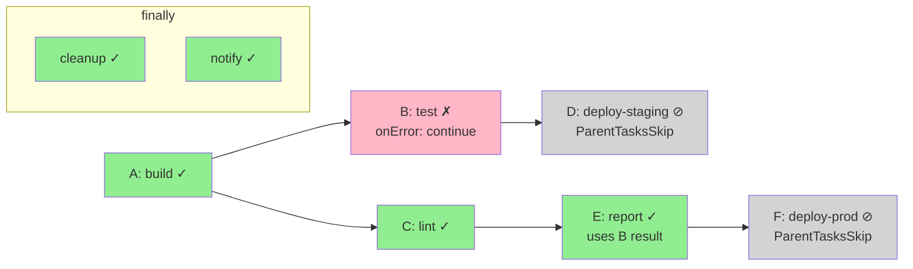
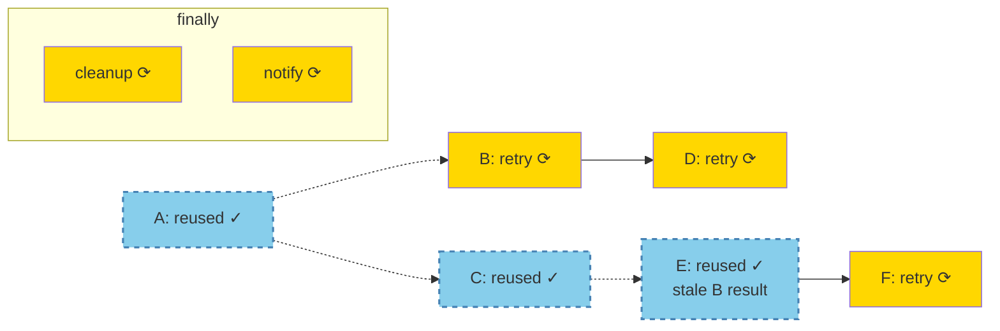

# Partial PipelineRun Retry — Design Proposal

> **Document Type:** Design Proposal & Evaluation 
> **Status:** Work in Progress 
> **Last Updated:** 2026-09-22 
> **Jira Epic:** [SRVKP-14121](https://redhat.atlassian.net/browse/SRVKP-14121)

---

## Purpose

This document proposes specific design decisions and implementation approaches for partial PipelineRun retry functionality in Tekton Pipelines. It builds on the technical foundation established in `research/architecture-analysis.md`.

**Scope:** 
- Failed subgraph computation rules
- Result re-injection (memoization) mechanisms
- Retry planning boundary evaluation (controller vs. client-side)
- Workspace/PVC handling strategies
- Pipeline definition stability approaches
- Data availability strategies (pruning, Tekton Results integration)
- API shape, security, and provenance requirements

**Prerequisites:** 
- Read `research/architecture-analysis.md` first (Parts 1-4)
- Familiarity with `research/adr-new-object-model.md` (decision to use new PipelineRun per retry)

---

## Table of Contents

1. [Part 5 — Design: Failed Subgraph Computation Rules](#part-5--design-failed-subgraph-computation-rules)
2. [Part 6 — Design: Result Re-injection (Memoization)](#part-6--design-result-re-injection-memoization)
3. [Part 7 — Design Evaluation: Retry Planning Boundary](#part-7--design-evaluation-retry-planning-boundary)
4. [Part 8 — Design Evaluation: Workspace PVC Handling](#part-8--design-evaluation-workspace-pvc-handling)
5. [Part 9 — Design Evaluation: Pipeline Definition Stability](#part-9--design-evaluation-pipeline-definition-stability)
6. [Part 10 — Design Evaluation: Data Availability Strategies](#part-10--design-evaluation-data-availability-strategies)
7. [Part 11 — Design Evaluation: API Shape, Security & Provenance](#part-11--design-evaluation-api-shape-security--provenance)

---

## Part 5 — Design: Failed Subgraph Computation Rules

### 5.1 Subgraph Computation Rules

The retry subset is determined by applying the following rules to the original `PipelineRunFacts` to compute which DAG tasks to re-run and which to bypass.

1. **Explicit Failures, Cancellations & Interrupted Tasks (The Roots):** 
   Any DAG task whose run object meets one of the following conditions is added to the re-run set:
   
   **a) Terminal failure:** `Condition{Type: Succeeded, Status: False}` in its status. 
   This includes `Failed`, `Cancelled`, `TaskRunTimeout`, `PipelineRunTimeout`, and infrastructure 
   errors (e.g., `ImagePullBackOff`, `OOMKilled`).
   
   **b) Interrupted mid-flight:** Task does not have `Condition{Type: Succeeded, Status: True}` 
   **and** the `PipelineRun` was stopped (cancelled, timed out, or gracefully stopped) before the 
   task could reach a terminal state.
2. **Skip Cascades (The Victims):** Any DAG task that was skipped due to a downstream cascade from a failure must be re-run.
This includes tasks with `SkippingReason` set to `ParentTasksSkip`, `StoppingSkip`, `MissingResultsSkip`, `PipelineRunTimeoutSkip`, or `GracefullyStoppedSkip`.
3. **Intentional Skips (The Bypasses):** Tasks skipped with `WhenExpressionsSkip` made a deliberate conditional decision and are **excluded** from the re-run set. In the new `PipelineRun`, their `WhenExpressions` will be re-evaluated naturally against the new context.
4. **`onError: continue` Resolution:** 
    *   **The failed task itself:** Always included in the re-run set, regardless of the pipeline's configured tolerance for it.
    *   **Scenario A (Upstream failed, emitted result, downstream succeeded):** Downstream tasks are **excluded** from the re-run set. 
    *Tradeoff:* If the retried upstream task emits a different result value, the downstream task's previously successful output becomes stale and inconsistent. This risk is accepted for v1 to align with CI/CD immutability norms.
    *   **Scenario B (Upstream failed, no result, downstream ValidationFailed):** The downstream task is **included** in the re-run set, as it functionally never ran because it lacked required inputs .
    *   **Scenario C (Upstream failed with onError: continue, downstream has ordering-only dependency via runAfter):** 
    If the downstream task depends on the upstream via `runAfter` but does NOT reference any of its results, 
    and the downstream task **succeeded** in the original run, it is **excluded** from the re-run set.
    *Rationale:* The downstream's execution was valid even though the upstream failed — it only required 
    ordering guarantees, not data outputs. Re-running it would duplicate valid work.
5. **Matrix Granularity (Policy B):** For v1, if any combination within a `matrix` task fails, **all N combinations** are included in the re-run set.
The entire task's `ChildReferences` are removed and re-fanned out by the controller .
6. **Finally Tasks:** Finally tasks are **excluded** from the failed subgraph calculation. Because the retry is a new `PipelineRun` object, all finally tasks execute fresh automatically after the retry's DAG phase completes.
This ensures cleanup and notification logic accurately reflects the retry's outcome, rather than preserving the original run's state. 
7. **Custom Tasks (`CustomRun`):** Apply the same terminal state rules to `CustomRun.Status.Conditions` as built-in tasks . For v1, treat the `CustomRun` as an atomic unit;
the reconciler will not recurse into nested external controllers to retry partial custom state.
8. **Nested PipelineRuns:** Apply the same terminal state rules to the child `PipelineRun.Status.Conditions`. For v1, the child `PipelineRun` is treated as an atomic unit. If a child pipeline fails, the entire nested pipeline is re-run;
the partial retry logic does not recursively traverse down into the nested DAG.
9. **Task-Level Retries (Fresh Retry Budget):** Each retry `PipelineRun` is a new execution context. 
   Tasks with `taskSpec.retries` or `taskRef.retries` get their **full retry budget reset** in the new `PipelineRun`.
   

### 5.2 Example: Failed Subgraph Computation

**Original Pipeline Execution:**


```mermaid
graph LR
    A[A: build ✓] --> B[B: test ✗<br/>onError: continue]
    A --> C[C: lint ✓]
    B --> D[D: deploy-staging ⊘<br/>ParentTasksSkip]
    C --> E[E: report ✓<br/>uses B result]
    E --> F[F: deploy-prod ⊘<br/>ParentTasksSkip]
    
    style A fill:#90EE90
    style B fill:#FFB6C6
    style C fill:#90EE90
    style D fill:#D3D3D3
    style E fill:#90EE90
    style F fill:#D3D3D3
    
    subgraph finally
        cleanup[cleanup ✓]
        notify[notify ✓]                              
    end
    
    style cleanup fill:#90EE90
    style notify fill:#90EE90
```
                
**Task States:**
- **A** : ✓ Succeeded
- **B** : ✗ Failed (onError: continue)
- **C** : ✓ Succeeded
- **D** : ⊘ Skipped (ParentTasksSkip - runAfter B)
- **E** : ✓ Succeeded (used B's result despite failure)
- **F** : ⊘ Skipped (ParentTasksSkip - depends on D)
- **cleanup**: ✓ Succeeded (finally)
- **notify**: ✓ Succeeded (finally)

**Failed Subgraph Analysis:**

| Task | Reason | Re-run? |
|------|--------|---------|
| **A** | Succeeded, no downstream failures | ✗ **Bypass** (reuse results) |
| **B** | Explicit failure (Rule 1) | ✓ **Re-run** |
| **C** | Succeeded, independent branch | ✗ **Bypass** (reuse results) |
| **D** | ParentTasksSkip cascade (Rule 2) | ✓ **Re-run** |
| **E** | Succeeded, referenced B's result (Rule 4, Scenario A) | ✗ **Bypass** (accept staleness risk) |
| **F** | ParentTasksSkip cascade (Rule 2) | ✓ **Re-run** |
| **cleanup** | Finally task (Rule 6) | ✓ **Re-run fresh** (automatic) |
| **notify** | Finally task (Rule 6) | ✓ **Re-run fresh** (automatic) |

**Retry Execution:**


```mermaid
graph LR
    A[A: reused ✓] -.-> B[B: retry ⟳]
    A -.-> C[C: reused ✓]
    B --> D[D: retry ⟳]
    C -.-> E[E: reused ✓<br/>stale B result]
    E --> F[F: retry ⟳]
    
    style A fill:#87CEEB,stroke:#4682b4,stroke-width:2px,stroke-dasharray: 5 5
    style B fill:#FFD700
    style C fill:#87CEEB,stroke:#4682b4,stroke-width:2px,stroke-dasharray: 5 5
    style D fill:#FFD700
    style E fill:#87CEEB,stroke:#4682b4,stroke-width:2px,stroke-dasharray: 5 5
    style F fill:#FFD700
    
    subgraph finally
        cleanup[cleanup ⟳]
        notify[notify ⟳]
    end
    
    style cleanup fill:#FFD700
    style notify fill:#FFD700
```

**Legend:**
- 🟢 **Green (solid)**: Succeeded in original run
- 🔴 **Pink**: Failed in original run
- ⚪ **Gray**: Skipped (cascade)
- 🔵 **Blue (dashed)**: Reused in retry
- 🟡 **Yellow**: Re-executed in retry
                    

**Key Observations:**
- **Failed subgraph:** B, D, F (3 tasks)
- **Reused:** A, C, E (3 tasks)
- **Finally tasks:** Always run fresh, not part of subgraph calculation
- **E uses stale data:** Acceptable tradeoff for v1 (Rule 4, Scenario A)

### 5.3 Edge Cases & Validation

**Edge Case 1: All DAG tasks failed**
- **Subgraph:** Entire DAG
- **Behavior:** Equivalent to a full pipeline retry, but preserves lineage metadata and retry count
- **Action:** Accept the retry request

**Edge Case 2: Only finally tasks failed**
- **Subgraph:** Empty (no DAG tasks to retry)
- **Behavior:** Finally tasks run after DAG completion; retrying them in isolation is ambiguous
- **Action:** For v1, **reject** the retry request with error: "Cannot retry: only finally tasks failed. 
  Finally-only retry requires manual intervention or full pipeline rerun."
- **Future Work:** Phase 2 could support finally-only retry with explicit user confirmation

**Edge Case 3: Mixed error policies (stopAndFail + continue)**
- **Subgraph:** Compute independently per branch
- **Behavior:** A `stopAndFail` task failure creates `StoppingSkip` cascades (always re-run). 
  An `onError: continue` task failure in a different branch follows Rule 4 scenarios.
- **Action:** Apply rules 1-4 consistently regardless of other branches' error policies

**Edge Case 4: WhenExpressions re-evaluation changes outcome**
- **Original:** Task skipped with `WhenExpressionsSkip`
- **Retry:** When re-evaluates to `true` (e.g., param changed, time-based condition)
- **Behavior:** Task was intentionally skipped before (Rule 3), but condition now passes
- **Action:** Task **will execute** in retry. This is correct behavior — When conditions are dynamic.
- **User Warning:** CLI/UI should warn if re-evaluation may change skip decisions

**Edge Case 5: Manual TaskRun deletion**
- **Original:** User manually deleted a succeeded TaskRun before retry
- **Subgraph:** Would exclude it (Rule: succeeded tasks bypassed)
- **Behavior:** Result data unavailable for downstream tasks
- **Action:** Pre-flight validation detects missing TaskRun, rejects retry with error: 
  "Cannot retry: TaskRun for bypassed task 'X' was deleted. Required results unavailable."

**Edge Case 6: Nested pipeline partial failure**
- **Original:** Child PipelineRun has internal partial failure
- **Subgraph:** Treats child PipelineRun as atomic (Rule 8)
- **Behavior:** Entire child pipeline re-runs; does not compute subgraph within nested DAG
- **Action:** For v1, accept this limitation. Warn user that nested pipelines retry fully.
- **Future Work:** Recursive subgraph computation for nested pipelines


## Part 6 — Design: Result Re-injection (Memoization)

Because the retry operation generates a new `PipelineRun` object, the stateless reconciler will not natively see the `TaskRun` objects from the original execution in its `ChildReferences`. To prevent downstream tasks from failing to resolve their `$(tasks.X.results.Y)` parameter expressions, the system must explicitly inject the preserved results into the new run.

---

### 6.1 The Result Injection Problem

**Why injection is necessary:**

When a partial retry creates a new `PipelineRun`, the Tekton reconciler starts with a clean slate:
- `status.childReferences[]` is empty (no TaskRuns from original run)
- Result references like `$(tasks.clone.results.commit-sha)` have no source to resolve from
- Downstream tasks fail with `PipelineValidationFailed` (missing result references)

**Example scenario:**
```
Original run:
  clone (succeeded) → build (succeeded) → test (failed)
  └─ results: commit-sha=abc123

Retry run (WITHOUT result injection):
  test re-runs → references $(tasks.clone.results.commit-sha)
             → clone TaskRun doesn't exist in this PipelineRun
             → ValidationFailed: result not found

Retry run (WITH result injection):
  test re-runs → references $(tasks.clone.results.commit-sha)
             → ResolveResultRef finds "abc123" in spec.retriedTaskResults
             → Result resolves successfully
```

**Design constraint:** Result injection must happen **at PipelineRun creation time** (not during reconciliation) to maintain stateless reconciler principle.

---

### 6.2 Injection Mechanism: Option A (New Spec Field)

**Chosen approach:** Add new `spec.retriedTaskResults` field to PipelineRun CRD.

**API structure:**
```yaml
apiVersion: tekton.dev/v1
kind: PipelineRun
metadata:
  name: pr-123-retry-1
  annotations:
    tekton.dev/retryOf: "pr-123-uid-abc"
spec:
  pipelineRef:
    name: my-pipeline
  params: [...]
  workspaces: [...]
  
  # NEW FIELD: Memoized results from bypassed tasks
  retriedTaskResults:
    - pipelineTaskName: clone
      results:
        - name: commit-sha
          value: "abc123def456"
        - name: repo-url
          value: "https://github.com/org/repo"
    - pipelineTaskName: build
      results:
        - name: image-digest
          value: "sha256:789abc..."
        - name: build-id
          value: "12345"
```

**How it works:**
1. Controller's `/retry` endpoint computes failed subgraph (Part 5 rules)
2. Controller identifies bypassed tasks (successful tasks not in re-run set)
3. Controller harvests results from bypassed tasks (see 6.3)
4. Controller populates `spec.retriedTaskResults` when generating retry PipelineRun
5. Modified `ResolveResultRef()` checks this field as secondary lookup tier (see 6.4)

**Why a spec field (not status or annotations)?**
- **Spec carries intent:** Results are input state for the retry execution
- **Immutable after creation:** Results fixed at retry creation time (no drift)
- **Validated by admission controller:** Can enforce security checks on injected values
- **Clear semantics:** "This PipelineRun should resolve these results as if tasks ran"

---

### 6.3 Result Harvesting (Extraction Process)

**Harvesting process:**

**Priority order for extraction** (maximizes resilience to garbage collection):

```go
// Pseudocode for controller's retry endpoint
func extractResultsForBypassedTasks(originalPR *PipelineRun, bypassedTasks []string) ([]RetriedTaskResult, error) {
    retriedResults := []RetriedTaskResult{}
    
    for _, taskName := range bypassedTasks {
        taskResults := []Result{}
        
        // Priority 1: Check PipelineRun.Status.Results[] (bubbled-up results)
        // These survive TaskRun pruning (PipelineRuns live longer than TaskRuns)
        for _, prResult := range originalPR.Status.Results {
            if prResult.PipelineTaskName == taskName {
                taskResults = append(taskResults, Result{
                    Name:  prResult.Name,
                    Value: prResult.Value,
                })
            }
        }
        
        // Priority 2: Check TaskRun.Status.Results[] (direct from TaskRun)
        if len(taskResults) == 0 {
            taskRun := getTaskRun(originalPR, taskName)
            if taskRun == nil {
                return nil, fmt.Errorf(
                    "cannot retry: TaskRun for task '%s' was pruned and results not bubbled up.\n" +
                    "To enable retry after GC:\n" +
                    "  1. Bubble up results to Pipeline level (declare Pipeline.spec.results), OR\n" +
                    "  2. Install Tekton Results (Phase 2 feature)",
                    taskName)
            }
            
            for _, trResult := range taskRun.Status.Results {
                taskResults = append(taskResults, Result{
                    Name:  trResult.Name,
                    Value: trResult.Value,
                })
            }
        }
        
        // Priority 3: Query Tekton Results API (Phase 2, if enabled)
        if len(taskResults) == 0 && isResultsEnabled() {
            archivedResults, err := queryResultsAPI(originalPR.UID, taskName)
            if err == nil {
                taskResults = archivedResults
            } else {
                return nil, fmt.Errorf("cannot retry: results unavailable from etcd and Results API: %w", err)
            }
        }
        
        // Store harvested results
        if len(taskResults) > 0 {
            retriedResults = append(retriedResults, RetriedTaskResult{
                PipelineTaskName: taskName,
                Results:          taskResults,
            })
        }
    }
    
    return retriedResults, nil
}
```

**Harvesting priority rationale:**
1. **Tier 1 first:** Bubbled-up results in `PipelineRun.Status.Results[]` survive TaskRun pruning (TTL: ~7 days vs. ~24 hours)
2. **Tier 2 second:** Direct TaskRun results (only available if TaskRun not yet pruned)
3. **Tier 3 last:** External Results API (Phase 2 feature, requires Results installation)

**Error handling:** If all tiers fail, reject retry request immediately with actionable error message (fail-fast UX).

---

### 6.4 Modified ResolveResultRef Logic

**Existing function:** `pkg/reconciler/pipelinerun/resources/resultrefresolution.go:ResolveResultRef()`

**Updated implementation** (three-tier lookup):

```go
// ResolveResultRef resolves a result reference during PipelineRun reconciliation
func ResolveResultRef(pr *PipelineRun, state PipelineRunState, ref *ResultRef) (string, error) {
    taskName := ref.PipelineTask
    resultName := ref.Result
    
    // Tier 1: Live state (task actually executed in THIS retry)
    // Priority: Fresh execution always wins over memoized data
    if rpt := state[taskName]; rpt != nil {
        for _, tr := range rpt.TaskRuns {
            if tr.IsSuccessful() {
                for _, result := range tr.Status.Results {
                    if result.Name == resultName {
                        // Fresh result from current retry execution
                        return result.Value.StringVal, nil
                    }
                }
            }
        }
    }
    
    // Tier 2: Memoized state (from spec.retriedTaskResults)
    // This tier provides results for bypassed tasks
    if pr.Spec.RetriedTaskResults != nil {
        for _, memoized := range pr.Spec.RetriedTaskResults {
            if memoized.PipelineTaskName == taskName {
                for _, result := range memoized.Results {
                    if result.Name == resultName {
                        // Memoized result from original run
                        return result.Value.StringVal, nil
                    }
                }
            }
        }
    }
    
    // Tier 3: Tekton Results API (Phase 2, optional)
    // Fallback for pruned TaskRuns not memoized in spec
    if isResultsEnabled() && pr.Annotations["tekton.dev/retryOf"] != "" {
        originalPRUID := pr.Annotations["tekton.dev/retryOf"]
        if value, err := queryResultsAPI(originalPRUID, taskName, resultName); err == nil {
            // Archived result from Results API
            return value, nil
        }
    }
    
    // All tiers failed - result not found
    return "", &ResultNotFoundError{
        PipelineTask: taskName,
        ResultName:   resultName,
        Reason:       "result not found in live state, memoized state, or Results API",
    }
}
```

**Key design principles:**
- **Tier 1 always wins:** Prevents stale memoized data from overriding fresh execution
- **Tier 2 for bypassed tasks:** Provides results for tasks not re-run in this retry
- **Tier 3 for recovery:** Phase 2 feature to handle pruned TaskRuns after extended delays
- **Fail explicitly:** Clear error if result unavailable (triggers `ValidationFailed` task status)

**Reconciler integration:**
- No changes to reconciler reconcile loop
- `ResolveResultRef` called during parameter resolution (existing code path)
- Failed result resolution → task status `ValidationFailed` → downstream tasks skipped (existing behavior)

---

### 6.5 Known Limitations & Edge Cases

#### 6.5.1 Result Size Limits

**Constraint:** Tekton enforces **4KB limit** per result value (etcd value size limit).

**Impact on retry:**
- Large results (> 4KB) cannot be memoized via `spec.retriedTaskResults`
- Harvesting fails if bypassed task has oversized result

**Error handling:**
**Error:** Reject with clear message explaining 4KB limit and suggesting workspaces for large data.

**Mitigation guidance (documentation):**
- Results should store **metadata** only: commit SHAs, image digests, URLs, exit codes
- Use **workspaces** for large data: build artifacts, logs, test reports

---

#### 6.5.2 Array and Object Results

**Tekton v1 feature:** Results can be arrays or objects, not just strings.

**Example:**
```yaml
results:
  - name: test-failures
    type: array
    value: ["test1", "test2", "test3"]
  - name: build-metadata
    type: object
    value:
      commitSha: "abc123"
      buildId: "12345"
```

**Implementation requirement:**
- Store complex results as **JSON** in `spec.retriedTaskResults[].results[].value`
- `ResolveResultRef` must **reconstruct correct type** when returning value

**Pseudocode:**
**Implementation:** Store complex results as JSON, preserve type metadata, reconstruct on resolution.

---

#### 6.5.3 Race Condition Window

**Scenario:** TaskRun pruned between pre-flight validation and PipelineRun creation.

**Timeline:**
```
t=0   Controller validates: TaskRun exists ✓
t=1   Kubernetes TTL controller prunes TaskRun (background job)
t=2   Controller tries to harvest results → TaskRun not found ✗
```

**Mitigation:**
- **Atomic operation:** Validation and PipelineRun creation happen in **same HTTP request** (controller `/retry` endpoint)
- **Time window minimized:** Milliseconds (single reconcile operation vs. distributed client calls)
- **Fail gracefully:** If TaskRun disappears mid-request, return clear error (user can retry the retry request)

**Why controller-side wins:** Client-side approach (Option B from Part 7) has **minutes-long** race window (user validates → thinks about it → triggers retry).

---

#### 6.5.4 Manual TaskRun Deletion

**Scenario:** User/operator manually deletes a succeeded TaskRun before retry.

**Detection:**
- Pre-flight validation detects missing TaskRun
- Checks if result was bubbled up to `PipelineRun.Status.Results[]`
- If not bubbled: reject retry with error

**Error message:**
```
Cannot retry: TaskRun 'pr-123-clone' was deleted. Result data lost.

Partial retry after manual TaskRun deletion is not supported. Options:
  1. Full re-run (tkn pipelinerun start --from-pipelinerun pr-123), OR
  2. Install Tekton Results for long-term result storage (Phase 2)
```

**Why unsupported:** Manual deletion is an operator action outside normal Tekton lifecycle. System cannot guarantee data availability.

---

### 6.6 Alternative Approaches Considered

#### Option B: Synthetic TaskRuns (Rejected)

**Concept:** Create "ghost" TaskRuns with pre-populated `status.results[]` but no actual Pod.

**How it would work:**
1. Controller generates retry PipelineRun (normal)
2. Controller pre-creates TaskRuns for bypassed tasks with:
   - `status.conditions: [{type: Succeeded, status: True}]`
   - `status.results: [{name: commit-sha, value: abc123}]`
   - `metadata.annotations: {tekton.dev/synthetic: "true"}`
3. Controller adds synthetic TaskRuns to `status.childReferences[]`
4. Reconciler sees them as normal TaskRuns, resolves results normally

**Why rejected:**
-  **Violates TaskRun lifecycle:** TaskRuns without Pods break core Tekton assumption (every TaskRun has 1:1 Pod)
-  **Confuses provenance:** Chains sees TaskRuns but finds no Pod attestations (SLSA verification fails)
-  **Complex ownership:** Who owns synthetic TaskRuns? PipelineRun controller can't create TaskRuns directly (TaskRun controller does)
-  **Reconciler confusion:** Special-case logic needed: "if synthetic TaskRun, don't try to create Pod"
-  **Garbage collection:** When to delete synthetic TaskRuns? PipelineRun completion? But they're not "real" children.

---

#### Option C: Retry-Specific Reconciler Logic (Rejected)

**Concept:** Add "retry mode" flag to PipelineRun. Reconciler loads results from original run on-demand.

**How it would work:**
1. Retry PipelineRun has annotation: `tekton.dev/retry-mode: "true"`
2. During result resolution, reconciler checks annotation
3. If retry mode: query original PipelineRun's TaskRuns for results
4. Cache results in-memory for duration of reconcile loop

**Why rejected:**
-  **Violates stateless reconciler principle:** Reconciler depends on external state (original PipelineRun/TaskRuns)
-  **Tight coupling:** Retry logic embedded in core reconciler (harder to maintain)
-  **Performance:** Every result resolution triggers K8s API query to original run
-  **Complex testing:** Reconciler behavior depends on whether original run exists, TaskRuns pruned, etc.
-  **Hidden state:** Retry PipelineRun YAML doesn't show what results are being reused (bad observability)

---

#### Why Option A (Spec Field) Wins

 **Clean separation:** Spec carries state, reconciler stays stateless 
 **Explicit:** Retry PipelineRun YAML shows exactly what results are memoized (full transparency) 
 **Auditable:** Users/tools can inspect `spec.retriedTaskResults` to see what was reused 
 **Simple:** Minimal changes (just `ResolveResultRef` function, no reconciler changes) 
 **Testable:** Inject spec field in unit tests, verify result resolution (no need for complex original run setup) 
 **Secure:** Admission controller can validate injected results (prevent injection attacks)

---

### 6.7 CRD API Changes Required

**New field in `PipelineRunSpec`:**

```go
// pkg/apis/pipeline/v1/pipelinerun_types.go

type PipelineRunSpec struct {
    // ... existing fields ...
    
    // RetriedTaskResults holds memoized results from bypassed tasks in a partial retry.
    // This field is populated by the controller when generating a retry PipelineRun.
    // Results here take precedence over missing TaskRuns for bypassed tasks.
    // +optional
    RetriedTaskResults []RetriedTaskResult `json:"retriedTaskResults,omitempty"`
}

type RetriedTaskResult struct {
    // PipelineTaskName is the name of the task in the Pipeline
    PipelineTaskName string `json:"pipelineTaskName"`
    
    // Results are the result values from the original execution
    Results []TaskRunResult `json:"results"`
}
```

**Validation (admission webhook):**
```yaml
if spec.retriedTaskResults exists:
  - Require annotation tekton.dev/retryOf (must reference original PipelineRun)
  - Validate pipelineTaskNames match Pipeline spec
  - Validate result names match Task definitions
  - Enforce 4KB limit per result value
  - Reject if results contain suspicious patterns (injection attack detection)
```


---

## Part 7 — Design Evaluation: Retry Planning Boundary

### 7.1 The Core Question

When a user requests a retry, **who calculates which tasks to re-run**? Two fundamental approaches exist:

**Option A — Controller/API calculates (server-side):**
- User calls API endpoint: `POST /apis/tekton.dev/v1/namespaces/default/pipelineruns/pr-123/retry`
- Controller reads original PipelineRun/TaskRuns, computes failed subgraph, creates new PipelineRun with injected state
- Clients (tkn, Dashboard, Console) are thin wrappers around the API call

**Option B — Client calculates (client-side orchestration):**
- User runs `tkn pipelinerun retry pr-123`
- CLI reads K8s objects, computes failed subgraph, extracts results, generates new PipelineRun YAML
- CLI applies the YAML to cluster
- Controller reconciles it normally (no special "retry mode")

---

### 7.2 Option A: Controller/API Calculates

**Implementation approach:**
- New API endpoint or webhook: `/retry` subresource on PipelineRun
- Controller grows a retry path in `ReconcileKind()` or a separate retry controller
- Retry-specific admission validation

**Benefits:**
- **Centralized logic:** All clients get identical retry behavior
- **Consistent** across tkn, Dashboard, Console - no risk of divergent implementations
- **Simpler client code:** Just make API call, don't implement complex graph traversal
- **Server-side validation:** Controller validates PVC availability, result availability before creating retry
- **Easier to update:** Fix a bug once in controller, all clients benefit immediately

**Drawbacks:**
- **Controller complexity:** Adds new code path to already complex PipelineRun reconciler
- **New API surface:** Requires designing/versioning a retry API (breaking change risk)
- **Testing overhead:** Must test controller retry path in isolation from normal reconcile
- **Tight coupling:** Retry logic embedded in controller lifecycle (harder to maintain separately)
- **Does not align with K8s patterns:** Most K8s operations are declarative (apply YAML), not imperative (call endpoint)

---

### 7.3 Option B: Client Calculates

**Implementation approach:**
- Shared library `pkg/retry` in tektoncd/pipeline repo
- Exported functions: `ComputeFailedSubgraph()`, `ExtractResults()`, `GenerateRetryPipelineRun()`
- tkn, Dashboard, Console import the library
- Controller unchanged (no retry-specific logic)

**Benefits:**
- **Simpler controller:** No new code paths, just normal reconcile
- **Declarative model:** Retry is "apply new PipelineRun YAML" (fits K8s paradigm)
- **Separation of concerns:** Retry planning separate from runtime execution
- **Easier to prototype:** Can implement `tkn retry` without touching controller
- **Lower risk:** Controller doesn't change, existing behavior unaffected
- **Matches prior art:** Argo Workflows uses client-side (`argo retry` CLI computes, controller reconciles)

**Drawbacks:**
- **Duplication risk:** Each client could reimplement logic independently (if library not used)
- **Shared library required:** Must maintain `pkg/retry` with stable API
- **Version skew:** Client library version might not match controller version
- **Client must understand Tekton internals:** Graph traversal, result propagation, skip reasons

---

### 7.4 Prior Art Comparison

| System | K8s-Native? | Retry Orchestration | Notes |
|--------|-------------|---------------------|-------|
| **Argo Workflows** | ✓ Yes | **Client-side** | `argo retry` CLI computes memoized state, generates new Workflow YAML, applies it |
| **GitHub Actions** | ✗ No (SaaS) | Server-side | API endpoint handles retry planning |
| **GitLab CI** | ✗ No (SaaS) | Server-side | Backend recalculates pipeline state |
| **CircleCI** | ✗ No (SaaS) | Server-side | API-driven retry |
| **Jenkins** | ✗ No (pre-K8s) | Server-side | Master (controller) handles restart-from-stage |


**Key insight:** The only K8s-native system (Argo) uses client-side orchestration. SaaS systems use server-side but aren't constrained by K8s patterns.

---

### 7.4.1 Evaluation Against Key Criteria

| Criterion | Option A (Controller) | Option B (Client) | Winner |
|-----------|----------------------|-------------------|--------|
| **Code Duplication** | ✓ Logic in one place (controller) |  Requires shared library to avoid duplication across tkn/Dashboard/Console | **A** |
| **Performance & Repeated Calculations** | ✓ Calculated once, cached in API response | ✗ Each client recalculates (CLI + Dashboard preview + Console UI = 3x work) | **A** |
| **Consistency Across Clients** | ✓ All clients get identical results |  Risk of version skew between client library versions | **A** |
| **API Complexity** | ✗ New API endpoint, versioning, breaking change risk | ✓ No API changes, uses existing create PipelineRun | **B** |
| **Debugging** |  Server-side logic harder to inspect | ✓ Client generates YAML, users can inspect before apply | **B** |
| **Transparency** | ✗ Retry plan hidden in API call | ✓ Generated PipelineRun YAML shows exactly what will run | **B** |

**Score: Option A wins 3/6 criteria, but wins on the most critical ones (performance, consistency, code duplication)**

---

### 7.4.2 Performance Analysis: Repeated Calculations

**Scenario:** User wants to retry a failed PipelineRun with 50 tasks, 10 failed.

#### Option B (Client-side): Work is Duplicated

1. **User runs CLI:** `tkn pipelinerun retry pr-123` → **Calculation #1**
2. **User opens Dashboard to preview retry plan** → **Calculation #2** (duplicates same work)
3. **User checks OpenShift Console to verify** → **Calculation #3** (duplicates same work)
4. **CI system auto-retry script validates retry** → **Calculation #4** (duplicates same work)

**Each calculation requires:**
- Fetch PipelineRun from K8s API (1 call)
- Fetch 50 TaskRuns from K8s API (50 calls)
- Parse DAG dependencies from Pipeline spec
- Compute failed subgraph (graph traversal)
- Extract results from 40 succeeded TaskRuns
- Validate result availability
- Generate new PipelineRun YAML

**Total work:** 4 calculations × 51 K8s API calls = **204 API calls** 
**CPU cost:** 4× subgraph computation, 4× result extraction

---

#### Option A (Controller-side): Work Calculated Once

1. **Any client calls:** `POST .../pipelineruns/pr-123/retry` → **Calculation #1** (server-side)
   - Controller computes failed subgraph
   - Controller caches result for 5 minutes (or until PR state changes)
2. **All subsequent clients** (tkn, Dashboard, Console, CI scripts) get **cached plan** → **0 recalculations**

**Total work:** 1 calculation × 51 K8s API calls = **51 API calls** 
**CPU cost:** 1× subgraph computation, 1× result extraction

---

**Verdict:** 
- **Option A is 4× more efficient** for multi-client scenarios
- **Reduces K8s API load** by 75% (204 calls → 51 calls)
- **Critical for large pipelines** (100+ tasks = 400+ API calls saved)

---

### 7.4.3 Security & RBAC Considerations

#### Option A (Controller/API)

**RBAC Model:**
```yaml
apiVersion: rbac.authorization.k8s.io/v1
kind: Role
rules:
  - apiGroups: ["tekton.dev"]
    resources: ["pipelineruns/retry"]  # NEW subresource
    verbs: ["create"]
```

**Security Properties:**
- **Fine-grained control:** Can grant retry permission separately from create/delete
- **Audit trail:** All retry requests logged server-side with user identity
- **Policy enforcement:** Controller can enforce org policies (e.g., "no retries in prod namespace after 5pm")
- **Immutable retry plan:** Server calculates plan, user cannot tamper with subgraph
- **New attack surface:** `/retry` endpoint is new code path to secure

**Example policy enforcement:**
```go
// Controller can block retries based on namespace, time, user, etc.
if pr.Namespace == "production" && time.Now().Hour() >= 17 {
    return errors.New("production retries blocked outside business hours")
}
```

---

#### Option B (Client-side)

**RBAC Model:**
```yaml
apiVersion: rbac.authorization.k8s.io/v1
kind: Role
rules:
  - apiGroups: ["tekton.dev"]
    resources: ["pipelineruns"]
    verbs: ["get"]        # Read original PR
  - apiGroups: ["tekton.dev"]
    resources: ["pipelineruns"]
    verbs: ["create"]     # Create retry PR (no special permission)
```

**Security Properties:**
- **No new attack surface:** Uses existing create permission
- **Existing RBAC:** Reuses well-tested permission model
- **No retry-specific audit:** Can't distinguish retry from new run in audit logs
- **No policy enforcement:** Client-side validation can be bypassed by crafting YAML manually
- **Coarse-grained:** If user can create PipelineRuns, they can retry (no separate permission)

**Risk scenario:**
- User with `create pipelineruns` permission can retry failed prod pipeline by manually crafting YAML
- No server-side policy can block this (it looks like a normal new PipelineRun)

---

**Verdict:** 
- **Option A provides better audit trail and policy enforcement**
- **Option B has lower security risk** (no new code paths to exploit)
- For enterprise environments with compliance requirements, **Option A is preferred**

---

### 7.5 Recommendation

**For v1: Controller/API calculates (Option A)** with retry endpoint.

#### Rationale

1. **Avoids repeated calculations (Performance):** Failed subgraph computation, result extraction, and validation happen once on the server rather than by every client that needs to display or execute a retry. For a 50-task pipeline with 3 clients (CLI, Dashboard, Console), this saves 75% of computation and API calls.

2. **Consistent behavior (Correctness):** All clients get identical retry plans without risk of version skew between client library and controller. A bug fix in the controller immediately benefits all clients.

3. **Better for multi-client scenarios (UX):** Dashboard preview, CLI dry-run, Console UI all query the same server-calculated plan. Users see the same retry plan regardless of which UI they use.

4. **Simpler client code (Maintainability):** Clients just call API endpoint, don't need to understand graph traversal, skip cascade rules, or result propagation logic. Reduces complexity in 3+ client codebases (tkn, Dashboard, Console).

5. **Better audit & policy enforcement (Security):** Server-side retry requests are logged with user identity. Organizations can enforce policies like "no production retries outside business hours" or "maximum 3 retry attempts per PipelineRun."

#### Trade-offs Accepted

- **Controller grows more complex:** Adds retry calculation path to PipelineRun reconciler (estimated +500 LOC)
- **Requires API versioning:** `/retry` subresource requires careful API design and stability guarantees
- **Deviates from pure declarative K8s pattern:** But Kubernetes itself has imperative operations (`scale`, `rollout restart`, `logs`)

#### Why Not Option B?

While Option B (client-side) aligns better with Kubernetes declarative principles and is used by Argo Workflows, it's suboptimal for Tekton's multi-client ecosystem. The performance cost of repeated calculations and the risk of version skew across 3+ client implementations outweigh the benefits of keeping the controller simple.


---

#### Hybrid Approach Possibility

Both approaches can theoretically coexist:
- Primary path: Server-side `/retry` API (default, optimized for consistency)
- Optional path: Client-side generation (for preview, customization, air-gapped scenarios)

**For v1, the recommended option is : Server-side only (Option A).** Hybrid capabilities can be added in future versions if user demand justifies the complexity.
---

## Part 8 — Design Evaluation: Workspace PVC Handling

Workspace data persistence (specifically persistent volume claims attached via Tekton's `AffinityAssistant`) is a primary challenge for partial retries. When downstream tasks are retried, they often depend on data left in a workspace by an upstream task that is being bypassed.

---

### 8.1 Key Workspace & PVC Challenges

1. **Affinity Assistant Cleanup on Failure:** By default, Tekton's Affinity Assistant manages pod co-location and PVC lifecycles. On `PipelineRun` failure, the controller cleans up Affinity Assistant resources.
2. **PVC Auto-Deletion (`AffinityAssistantPerPipelineRun`):** Under `AffinityAssistantPerPipelineRun` mode, the underlying PVC is bound strictly to the single `PipelineRun` lifecycle and is deleted immediately upon pipeline completion.
3. **The Race Condition:** In automated pipelines, PVC deletion happens within seconds of failure. A human engineer executing `tkn pipelinerun retry` 15 minutes later will find that the workspace data is already destroyed, leading to runtime pod mounting failures.

---

### 8.2 Affinity Assistant Mode Behavior Matrix

| Mode / PVC Type | PVC Ownership | Deletion Trigger | Partial Retry Impact |
|:---|:---|:---|:---|
| **`AffinityAssistantPerPipelineRun`** | StatefulSet VolumeClaimTemplate | `PipelineRun` completion/failure (immediate) |  **Blocks Retry:** Data lost immediately. |
| **`AffinityAssistantPerWorkspace`** | Tekton Controller directly | Auto-cleaned if `tekton.dev/auto-cleanup-pvc=true` |  **Conditional:** Retries work unless auto-cleanup is enabled. |
| **`AffinityAssistantDisabled`** | Tekton Controller directly | Manual cleanup required |  **Allows Retry:** Data preserved indefinitely. |
| **User-Provided PVC** (`persistentVolumeClaim`) | External K8s resource | Managed by cluster administrator |  **Allows Retry:** Data preserved across runs. |

---

### 8.3 Strategy Evaluation for Workspace Preservation

#### Option A: Immediate Mode Restrictions
Restrict partial retry functionality exclusively to pipelines configured with `AffinityAssistantPerWorkspace` (without auto-cleanup), `AffinityAssistantDisabled`, or user-provided PVCs. If a user attempts to retry a pipeline using `AffinityAssistantPerPipelineRun`, the request is rejected immediately at creation time.

* **Pros:** Simple, reliable, zero risk of runtime volume-mount failures due to missing PVCs.
* **Cons:** Inflexible. Users with default Tekton configurations (`PerPipelineRun`) cannot use partial retries without changing global cluster flags or pipeline definitions.

#### Option B: Pre-Flight Validation + Clear Error Messages
Allow retry requests across all modes, but perform an active pre-flight check against the Kubernetes API to confirm that the required PVC still exists and is in a `Bound` state before generating the retry `PipelineRun`.

* **Pros:** Excellent user experience. Provides fast, actionable failure messages (e.g., *"Cannot retry: Workspace PVC 'ws-123' was deleted. Switch to AffinityAssistantPerWorkspace or user-provided PVCs to retain workspace state across retries."*).
* **Cons:** Does not save data that has already been deleted; only gracefully handles the failure.

#### Option C: Deferred Cleanup with Retry Window
Modify the Tekton controller to introduce a configurable retention delay (TTL) on `AffinityAssistant` and PVC deletion following a `PipelineRun` failure (e.g., `retentionWindow: 2h`).

* **Pros:** Solves the race condition for default configurations. Gives operators a window to trigger retries before garbage collection runs.
* **Cons:** Adds significant controller complexity (timer/queue management, delayed reconciliation). Consumes storage resources for failed runs that may never be retried.

#### Option D: Retry-Specific Workspace Re-creation
If required workspace data is lost (PVC missing), the retry algorithm automatically adds the upstream "workspace-producer" tasks (e.g., git-clone) back into the failed subgraph to re-populate the workspace before running the failed tasks.

* **Pros:** Enables retries even if the original PVC was destroyed.
* **Cons:** Extremely difficult to determine statically which upstream tasks produced which workspace files. Highly prone to edge-case failures if producer tasks have side effects.
    Example:
      Pipeline: clone → build → test (fails)
      
      Which task "produced" /workspace/source?
      - clone writes initial files
      - build writes compiled artifacts to same workspace
      
      If we re-run only clone, we lose build artifacts.
      If we re-run clone+build, we waste compute.
      Static analysis cannot determine this reliably.

---

### 8.4 Evaluation Summary & Recommendations

| Criterion | Option A (Mode Restrictions) | Option B (Pre-flight Checks) | Option C (Deferred Cleanup) | Option D (Workspace Re-creation) |
|:---|:---:|:---:|:---:|:---:|
| **Implementation Effort** | Low | Low | High | Very High |
| **Data Guarantee** | High | High (Validation) | Medium (Time-bound) | Low (Heuristic) |
| **Controller Complexity** | Low | Low | High | Extremely High |
| **User UX Clarity** | Clear rejection | Clear error message | Silent expiry after TTL | Potentially unexpected task execution |

#### Recommendation for v1: Hybrid Option A + Option B

1. **Enforce Option A & B for v1:** Combine pre-flight checks with mode validation. The controller/CLI validates that all required PVCs exist and are `Bound`. If a PVC was deleted due to `AffinityAssistantPerPipelineRun` or garbage collection, reject the retry immediately with a clear error message explaining how to configure workspaces for retries.
2. **Defer Option C to Phase 2:** Explore a configurable TTL window (`retentionWindow`) in a future release if user telemetry shows `PerPipelineRun` cleanup is a major blocker for retry adoption.
3. **Reject Option D:** Statically inferring workspace dependencies is too fragile for core Tekton reconciler logic.

---

### 8.5 Workspace Staleness & Side Effect Warnings

#### Workspace Content Staleness (Known Risk)
If a pipeline task succeeds, is bypassed, and its workspace data is reused in a retry, the data reflects the state at the time of the *original* failure. If external state changed in the interim (e.g., a developer pushed new commits to the remote Git branch), the retried task will operate on the old workspace contents.
* **Mitigation:** Document this immutability contract clearly. Pre-flight CLI/UI warnings should remind users that retried tasks execute against preserved workspace snapshots.

#### Mandatory Side Effect Warning
Because Tekton cannot automatically guarantee task idempotency, interactive clients (`tkn` CLI, Tekton Dashboard, Console) must prompt the user prior to triggering a retry:

```text
WARNING: Partial retry will re-execute failed tasks and reuse existing workspace PVCs.
    If tasks have non-idempotent side effects, re-execution may duplicate actions:
    - Deployments may duplicate external resources
    - Workspace contents reflect the state at original execution time
    
    Do you want to proceed? [y/N]
    
```

---

## Part 9 — Design Evaluation: Pipeline Definition Stability

When a PipelineRun references remote resources (Tasks or Pipelines resolved from Git repositories or OCI registries), those resources may change between the original run and a retry. This section evaluates strategies to ensure retry executions use the **same definitions** as the original run, maintaining reproducibility and compliance requirements.

---

### 9.1 The Resolution Drift Problem

**Core challenge:** Remote references are often **mutable** (Git branches, OCI tags) and can point to different content over time.

**Scenario:**
```yaml
# Day 1: User creates PipelineRun
apiVersion: tekton.dev/v1
kind: PipelineRun
spec:
  pipelineRef:
    resolver: git
    params:
      - name: url
        value: https://github.com/org/tasks
      - name: revision
        value: main  # Mutable reference
      - name: pathInRepo
        value: task.yaml

# Day 1: Resolves to commit abc123def456...
# Pipeline runs, task fails

# Day 2: Developer pushes bug fix to main
# main now points to commit 789abc123...

# Day 3: User retries pipeline
# Question: Should retry use abc123 (original) or 789abc (latest)?
```

**Industry standard:** Use **same commit** as original run (abc123, not 789abc).

**Why reproducibility matters:**
1. **Compliance & Auditing:** Security audits must prove exactly what code executed
2. **Debugging:** If retry succeeds after original failed, need to know if it's the same code or different fix
3. **SLSA Provenance:** Attestations must link to immutable artifact sources (commit SHAs, OCI digests)
4. **Determinism:** Retry should test whether the failure was transient, not whether the new code works

---

#### 9.1.1 Mutable vs. Immutable References

**Git references:**
- **Mutable:** Branches (`main`, `feature/x`), tags (`v1.0.0` can be moved)
- **Immutable:** Commit SHAs (`abc123def456...`)

**OCI references:**
- **Mutable:** Tags (`latest`, `v1.0`)
- **Immutable:** Digests (`sha256:abc123...`)

**Tekton behavior today:**
- User specifies mutable ref → Remote resolver queries upstream → Resolves to immutable ref (SHA/digest)
- Original resolved SHA **is recorded** in `ResolutionRequest.Status.Data` (but not stored long-term in PipelineRun)

**Retry requirement:** Must preserve and reuse the original resolved SHA/digest, not re-resolve mutable ref.

---

#### 9.1.2 Multi-Level Resolution Problem

**Complexity:** Pipelines can reference Tasks, which themselves reference other remotes. **Both levels must be pinned.**

**Example:**
```yaml
# Level 1: Pipeline resolved from Git
pipelineRef:
  resolver: git
  params:
    - name: url
      value: https://github.com/org/pipelines
    - name: revision
      value: main  # → Resolves to commit abc123 at Day 1
    - name: pathInRepo
      value: ci-pipeline.yaml

# Level 2: Within that Pipeline, tasks reference OCI bundles
# (from resolved ci-pipeline.yaml)
apiVersion: tekton.dev/v1
kind: Pipeline
spec:
  tasks:
    - name: build
      taskRef:
        resolver: bundles
        params:
          - name: bundle
            value: gcr.io/org/tasks:latest  # → Resolves to sha256:def456 at Day 1
```

**Challenge:** If we only pin the Pipeline SHA (abc123), the nested Task ref (`latest`) can still drift to sha256:xyz789.

**Required:** Recursively pin both Pipeline definition (Level 1) AND all nested Task references (Level 2).

**How each option handles multi-level resolution:**
- **Option A (Status Snapshot):** Resolved Pipeline status already includes fully-resolved nested Task specs (recursive inlining) ✓
- **Option B (SHA Pinning):** Must recursively track and pin Pipeline SHA + all Task SHAs (complex implementation) 
- **Option C (Hybrid):** Inline specs automatically include resolved Tasks (recursive by design) ✓
- **Option D (Validate-Only):** Either level drifting causes failure (brittle) ✗

---

### 9.2 Strategy Evaluation for Definition Stability

Four approaches exist to ensure retry uses original definitions. Each trades off **storage size**, **provenance traceability**, and **resilience to remote failures**.

---

#### Option A: Extract from Inlined Specs (Status Snapshot)

**How it works today:**

When Tekton resolves a remote resource, the reconciler **stores the full resolved spec** in the run object's status:
- `TaskRun.Status.TaskSpec` (resolved Task definition, ~1-10KB)
- `PipelineRun.Status.PipelineSpec` (resolved Pipeline definition with inlined Tasks, ~10-100KB)

**For retry:**
1. Read `PipelineRun.Status.PipelineSpec` from original run
2. Copy entire spec into retry `PipelineRun.Spec.PipelineSpec` (inline)
3. Retry uses inline spec (no re-resolution needed)

**Example:**
```yaml
# Original run (after resolution)
apiVersion: tekton.dev/v1
kind: PipelineRun
metadata:
  name: pr-123
spec:
  pipelineRef:  # User provided this
    resolver: git
    params: [...]
status:
  pipelineSpec:  # Controller stored resolved spec here
    tasks:
      - name: build
        taskSpec:  # Resolved Task fully inlined
          steps:
            - name: compile
              image: golang:1.21
              script: go build ./...

---

# Retry run (generated by controller)
apiVersion: tekton.dev/v1
kind: PipelineRun
metadata:
  name: pr-123-retry-1
spec:
  pipelineSpec:  # Copied from original.status.pipelineSpec
    tasks:
      - name: build
        taskSpec:
          steps:
            - name: compile
              image: golang:1.21
              script: go build ./...
```

**Pros:**
- **Always available:** Resolved spec already stored in original run's status
- **Exact copy:** Guarantees byte-for-byte identical definition
- **No re-resolution needed:** Fast retry creation (~10ms vs. ~500ms for remote query)
- **Works if remote deleted:** Git repo made private, OCI registry deleted → retry still works
- **Handles multi-level resolution:** Nested Task specs already fully inlined recursively
- **No credential issues:** Doesn't need imagePullSecrets or Git tokens to retry

**Cons:**
-  **Large status size:** Full YAML embedded in status (10-100KB for complex Pipelines)
-  **Loses provenance metadata:** Resolved spec doesn't include original Git commit SHA or OCI digest
-  **Audit/security limitation:** Cannot trace back to immutable source artifact for compliance
-  **Bloats etcd:** Every PipelineRun status grows by 10-100KB

---

#### Option B: Store ResolutionRequest Content Hash (SHA Pinning)

**How it would work:**

1. **At original run creation:** Store hash of resolved content + remote ref metadata in annotations
2. **At retry time:** Re-resolve using remote resolver, validate that resolved content matches stored hash

**Annotations to add:**
```yaml
metadata:
  annotations:
    tekton.dev/resolved-content-sha256: "abc123..."  # Hash of resolved spec
    tekton.dev/resolver-type: "git"
    tekton.dev/resolver-url: "https://github.com/org/tasks"
    tekton.dev/resolver-revision: "abc123def456..."  # Git commit SHA or OCI digest
    tekton.dev/resolver-path: "task.yaml"
```

**For retry:**
1. Read annotations from original run
2. Call remote resolver with **pinned SHA** (not mutable ref)
3. Validate resolved content hash matches stored hash
4. Use resolved spec if validation succeeds

**Pros:**
-  **Small footprint:** Just hash + metadata (~100 bytes vs. 10-100KB)
-  **Perfectly preserves provenance:** Original Git commit SHA / OCI digest stored
-  **Audit/compliance ready:** Provenance tools can verify immutable source artifact
-  **Can detect drift:** If resolved content doesn't match hash, fail with clear error

**Cons:**
-  **Requires re-resolution:** Must query remote resolver at retry time (100-500ms latency)
-  **Fails if remote unavailable:** Git repo deleted, OCI registry down, auth expired → retry blocked
-  **Doesn't work for cluster-local Tasks:** No `ResolutionRequest` for in-cluster resources
-  **Complex for multi-level resolution:** Must recursively pin Pipeline SHA + all nested Task SHAs/digests
-  **Network dependency:** Retry creation blocked if network partition from Git/OCI registry

---

#### Option C: Hybrid Approach (Inline Specs + Provenance Annotations)

**How it works:**

Combine Option A (inline specs) with Option B (provenance metadata) to get both execution stability AND provenance traceability.

**For retry:**
1. Copy `PipelineRun.Status.PipelineSpec` → `PipelineRun.Spec.PipelineSpec` (inline, guarantees execution)
2. Extract original remote ref metadata (Git SHA, OCI digest) from `ResolutionRequest` objects
3. Add provenance annotations for audit/security tools

**Example:**
```yaml
apiVersion: tekton.dev/v1
kind: PipelineRun
metadata:
  name: pr-123-retry-1
  annotations:
    tekton.dev/retryOf: "pr-123-uid"
    # Provenance annotations (NEW)
    tekton.dev/original-pipeline-resolver: "git"
    tekton.dev/original-pipeline-url: "https://github.com/org/pipelines"
    tekton.dev/original-pipeline-revision: "abc123def456..."  # Git commit SHA
    tekton.dev/original-pipeline-path: "ci-pipeline.yaml"
spec:
  # Inline spec guarantees exact definition (NO re-resolution)
  pipelineSpec:
    tasks:
      - name: build
        taskSpec:
          steps:
            - name: compile
              image: golang:1.21
              script: go build ./...
```

**How provenance annotations are used in v1:**
1. **Audit/debugging** → Admins can reconstruct the original Git commit SHA or OCI digest from annotations
2. **Manual verification** → Security teams can compare stored SHAs against Git history for manual audits
3. **Documentation** → Provides traceability for compliance without external dependencies

**v2 enhancement (Chains integration):** See Part 9.8 for full Chains integration plan.

**Benefit:** Retry execution immune to remote availability, provenance preserved for audit (v1) and future SLSA attestation (v2).

**Pros:**
-  **Guarantees exact definition:** Inline spec ensures byte-for-byte identical code
-  **No re-resolution needed:** Fast retry creation, no remote queries
-  **Works if remote deleted:** Git repo/OCI registry unavailable → retry still works
-  **Preserves provenance:** Annotations provide Git SHA / OCI digest for audit tools
-  **Handles multi-level resolution:** Nested Task specs already inlined recursively
-  **Audit/compliance ready:** Provenance tools can reconstruct immutable source references
-  **No credential issues:** Doesn't need active imagePullSecrets or Git tokens

**Cons:**
-  **Very large spec:** Retry PipelineRun objects can be 10-100KB (inline YAML + annotations)
-  **Not fully declarative:** Retry YAML can't be reconstructed by hand from original `pipelineRef` alone
-  **etcd bloat:** Retry PipelineRun specs much larger than normal runs

**Mitigation for spec size:**
- Modern etcd handles 10-100KB values easily (default limit: 1.5MB)
- Inline `pipelineSpec` already common in Tekton (many users don't use remote resolution)
- Retry PipelineRuns are derived objects (less frequent than normal runs)
- Storage is cheaper than operational failures (remote outages blocking retries)

---

#### Option D: Validation-Only (Detect Drift, Fail Fast)

**How it would work:**

1. Copy original `pipelineRef` exactly as written (mutable refs like `main`, `latest`)
2. At retry time, re-resolve mutable ref
3. Compare resolved SHA against original run's resolved SHA
4. If different → reject retry with error

**Example error:**
```
Cannot retry: Pipeline definition changed since original run.
  Original: commit abc123def456...
  Current:  commit 789abc123...
  
  To retry, either:
    1. Revert upstream changes to abc123, OR
    2. Manually create retry PipelineRun with inline pipelineSpec
```

**Pros:**
-  **Zero spec bloat:** No new fields, no annotations
-  **Simple implementation:** Just SHA comparison logic

**Cons:**
-  **Unacceptably brittle:** Most delayed retries would fail (developers constantly push to `main`)
-  **Poor UX:** Retry fails hours/days after original with cryptic "definition changed" error
-  **Doesn't solve problem:** Only detects drift, doesn't enable retry
-  **Blocks legitimate retries:** Even if new code is fine, user forced to revert or manual workaround

**Verdict:** Not viable for production use (fails the "does this solve the user's problem?" test).

---

### 9.2.1 Evaluation Matrix    

| Criterion | Option A (Status Snapshot) | Option B (SHA Pinning) | Option C (Hybrid) | Option D (Validate-Only) |
|-----------|---------------------------|------------------------|-------------------|-------------------------|
| **Guarantees Exact Definition** | ✓ Yes | ⊘ Yes (if remote available) | ✓ Yes | ✗ No (fails if changed) |
| **Works if Remote Deleted** | ✓ Yes | ✗ No (resolution fails) | ✓ Yes | ✗ No |
| **Preserves Provenance** | ✗ No (loses Git SHA) | v Yes | ✓ Yes (via annotations) | ✓ Yes (but brittle) |
| **Spec Size Impact** | ⊘ Large (status bloat) | ✓ Small (just hash) | ✗ Very Large (inline YAML) | ✓ None |
| **Re-resolution Required** | ✓ No | ✗ Yes | ✓ No | ✗ Yes |
| **Resilience to Outages** | ✓ High | ✗ Low | ✓ High | ✗ Low |
| **Preserves Provenance Metadata** | ✗ No (loses Git SHA) | ✓ Yes | ✓ Yes (via annotations) | ✓ Yes (but brittle) |
| **Handles Multi-Level Resolution** | ✓ Yes (automatic) | ⊘ Yes (complex) | ✓ Yes (automatic) | ✗ No (brittle at each level) |
| **Network Independence** | ✓ Yes | ✗ No | ✓ Yes | ✗ No |

**Winner: Option C (5 ✓ / 1 ✗ / 2 ⊘)** — Best balance of execution stability, provenance preservation, and operational resilience.

---

### 9.3 Recommended Approach: Option C (Hybrid)

**For v1: Inline resolved specs + provenance annotations**

**Rationale:**

1. **Execution guarantee:** Retry uses exact same code as original (immune to upstream drift, deletion, outages)
2. **Provenance guarantee:** Annotations preserve immutable source references (Git commit SHA, OCI digest) for audit/security tools (v1) and future Chains integration (v2)
3. **Operational resilience:** Works even if Git repo made private, OCI registry down, credentials expired
4. **Debugging clarity:** Engineers can inspect inline spec to see exactly what code ran

**Implementation:**

**Implementation:**

**Step 1: At retry-request time** (controller `/retry` endpoint)
1. Extract resolved spec from `originalPR.Status.PipelineSpec`
2. Extract provenance metadata from `ResolutionRequest` objects (Git SHA, OCI digest)
3. Generate retry PipelineRun with:
   - Inline `pipelineSpec` (guarantees exact definition)
   - Provenance annotations (Git commit SHA / OCI digest)
   - Copy original params, workspaces

**Step 2: Provenance tools** (v1: audit/debugging, v2: Chains integration)
- Annotations enable manual verification against Git history
- Future Chains integration reads annotations for SLSA attestation (see Part 9.8)

**Result:** Retry execution stable, provenance metadata preserved, no remote dependencies.

**Result:** Retry execution stable, provenance metadata preserved for audit/debugging, no remote dependencies.

**Note:** Provenance annotations serve immediate audit and compliance needs in v1 (see Section 9.3.1). Tekton Chains integration is planned for v2 (see Section 9.8).

---

### 9.3.1 Provenance Strategy for v1 (Chains-Independent)

**Design principle:** Provenance annotations serve **immediate audit and debugging needs** in v1, independent of Chains.

**Use cases without Chains:**

1. **Security Audit:** Operators can trace retry executions back to exact Git commit
   ```bash
   kubectl get pr pr-123-retry-1 -o yaml | grep original-pipeline-revision
   # Output: abc123def456... (immutable Git SHA)
   ```

2. **Debugging:** Engineers can verify which code version ran
   ```bash
   # Did retry use same code as original?
   ORIG_SHA=$(kubectl get pr pr-123 -o jsonpath='{.status.pipelineSpec...}')
   RETRY_SHA=$(kubectl get pr pr-123-retry-1 -o jsonpath='{.spec.pipelineSpec...}')
   echo "Match: $([ "$ORIG_SHA" = "$RETRY_SHA" ] && echo 'yes' || echo 'no')"
   ```

3. **Compliance:** Immutable source references satisfy regulatory requirements
   - PCI-DSS: "Track and monitor all access to system components"
   - SOC 2: "Document changes to system configurations"
   - GDPR: "Maintain records of processing activities"

4. **Incident Response:** Link failed builds to specific code changes
   ```
   pr-123 failed → annotations show commit abc123
   Developer investigates: git show abc123
   Finds bug introduced in that commit
   ```

**Chains integration (v2):** These annotations will enable Tekton Chains to generate SLSA provenance attestations, but this is **not required** for v1 functionality.

---

### 9.4 Edge Cases

**Edge Case 1: Remote Source Deleted**
- **Option A/C:** ✓ Works (spec captured in status)
- **Option B/D:** ✗ Fails (cannot re-resolve)

**Edge Case 2: OCI Registry Credentials Expired**
- **Option A/C:** ✓ Works (no re-resolution needed)
- **Option B/D:** ✗ Fails (401 Unauthorized)

**Edge Case 3: Pipeline Changed (Breaking)**
- **All Options:** Retry uses original definition (ignores breaking change)
- **Correct behavior:** Tests transient failure, not new code

**Edge Case 4: CustomRun External Controller**
- **v1:** Documented as unsupported (external controller manages own stability)
- **Mitigation:** CustomRun controller implements similar strategy

**Edge Case 5: Nested PipelineRun**
- **v1:** Treat as atomic unit (parent pins, child can drift)
- **Limitation:** Acceptable for v1, enhance in v2 if needed

**Edge Case 6: Git Force-Push**
- **All Options:** Cannot detect (violates Git integrity model)
- **Verdict:** Accept as operational risk (outside Tekton control)

---

### 9.5 CRD API Changes Required

**Good news:** No changes to PipelineRun CRD spec fields.

Uses existing `spec.pipelineSpec` field (inline Pipeline definition, already supported).

**New annotations** (metadata only):
- `tekton.dev/retryOf` - Original PipelineRun UID for lineage tracking
- `tekton.dev/original-pipeline-*` - Provenance metadata (resolver type, URL, revision/SHA, path)
  - **Full annotation schema:** See Part 9.3 example for complete list

**Controller implementation:**
- Add provenance extraction logic to `/retry` endpoint
- Query `ResolutionRequest` objects from original run (contain resolved Git SHA / OCI digest)
- Copy `PipelineRun.Status.PipelineSpec` → `PipelineRun.Spec.PipelineSpec`
- Populate provenance annotations

**Validation (admission webhook):**
- Verify format (Git SHA: 40 hex chars, OCI digest: sha256:64 hex chars)
- Reject if malformed

---

### 9.6 Trade-offs Accepted

#### Trade-off 1: Spec Bloat

**Reality:** Retry PipelineRun objects will be **10-100KB** (vs. ~1KB for normal runs with `pipelineRef`).

**Mitigation:**
- etcd default value limit: **1.5MB** (plenty of headroom)
- Inline `pipelineSpec` already common (many users don't use remote resolution)
- Retry PipelineRuns are derived objects (less frequent than normal runs)
- Storage is cheaper than operational failures (remote outages blocking retries)

**Measurement:** For a typical CI pipeline (10 tasks, each ~1KB Task spec) → ~10KB inline spec → **0.67% of etcd limit**

---

#### Trade-off 2: Not Fully Declarative

**Reality:** Retry PipelineRun YAML cannot be reconstructed by hand from original `pipelineRef` alone (requires original run's status as input).

**Mitigation:**
- This is **acceptable** — retry is a **derived object**, not a primary authored resource
- Users don't hand-write retry PipelineRuns (generated by controller `/retry` endpoint or `tkn` CLI)
- Transparency: Users can inspect generated YAML (kubectl get -o yaml) to see exactly what will run

**Analogy:** Similar to how Kubernetes StatefulSet creates Pods — users don't hand-write Pod YAML, they inspect generated Pods.

---

### 9.7 Future Work: v2+ Enhancements

**Tekton Chains Integration (Phase 2)**

The provenance annotations added in v1 prepare the groundwork for Tekton Chains integration. Chains can use these annotations to generate SLSA provenance attestations that distinguish retry executions.

**How Chains would use retry annotations (v2):**
- Detect retry via `tekton.dev/retryOf` annotation
- Read provenance (Git SHA, URL) from annotations
- Generate SLSA attestation linking to immutable source
- Distinguish inherited vs. fresh execution

**v2 implementation tasks:**
- Update Chains to read retry annotations for SLSA attestation
- Generate attestations distinguishing inherited vs. fresh execution (see Part 11.3)
- Document retry provenance contract for supply chain security

**Why defer to v2:** 
- Chains integration requires coordination with tektoncd/chains repository
- Retry functionality provides immediate value without Chains (audit, debugging, compliance)
- Provenance annotations in v1 are "Chains-ready" — no breaking changes needed for v2
- Similar pattern to Tekton Results integration (Phase 1 = independent, Phase 2 = optional integration)


---

## Part 10 — Design Evaluation: Data Availability Strategies

### 10.1 The Pruning Timeline (Expanded from Part 6.3)

**Kubernetes garbage collection phases:**

```
t=0     PipelineRun completes (Succeeded or Failed)
t+1h    TaskRun pods deleted (completed pods pruned quickly)
t+24h   TaskRuns pruned from etcd (default TTL-after-finished)
        └─ TaskRun.Status.Results[] lost if not bubbled up
t+7d    PipelineRuns pruned from etcd
        └─ PipelineRun.Status.Results[] lost
t+90d   Tekton Results records expire (configurable)
```

**Time window for retry:**
- **Phase 1 (K8s-only):** Hours to ~1 day (until TaskRuns pruned)
- **Phase 2 (with Results):** Weeks to months (until Results records expire)

### 10.2 Phase 1 Validation Approaches

**Option A — Pre-flight validation (fail fast):**
```go
// At retry-request time
validateRetryAvailability(originalPR) error {
    // Check 1: PipelineRun still exists
    if originalPR not found → return "PipelineRun pruned, cannot retry"
    
    // Check 2: Required TaskRuns exist
    for each bypassed task:
        tr := getTaskRun(task)
        if tr == nil:
            if result bubbled up → OK
            else → return "TaskRun pruned, result not bubbled up"
    
    return nil
}
```

**Benefits:**
- User gets instant feedback
- Clear error message with actionable guidance
- No wasted work (don't create retry if it will fail)

**Drawbacks:**
- Requires checking each TaskRun (N API calls for N bypassed tasks)
- Race condition: TaskRun could be pruned between validation and retry creation

**Option B — Best-effort (fail during reconcile):**
- Allow retry creation without validation
- Fail during ResolveResultRef() when result unavailable
- ValidationFailedTask → PipelineRun fails

**Benefits:**
- Simple - no validation logic
- Reuses existing result resolution code

**Drawbacks:**
- Poor UX - failure happens during execution, not immediately
- Wasted reconcile loops before failure detected

**Recommended:** **Option A** - pre-flight validation with clear error messages.

### 10.3 Phase 2: Tekton Results Integration Strategy

**Option A: Mandatory Tekton Results for Retry**

Partial retry only works if Tekton Results is installed and configured.

**Implementation:**
- Controller checks Results availability at startup
- Retry endpoint returns 501 Not Implemented if Results not configured
- All result extraction goes through Results API

**Pros:**
- Simple mental model (retry = requires Results)
- No ambiguity about data source
- Can enforce retention policies centrally

**Cons:**
- Cannot use retry without Results (blocks adoption)
- Tight coupling between core Pipelines and Results
- Results becomes a required dependency (was optional)

---

**Option B: Optional Tekton Results as Fallback**

Results is used opportunistically if available, but not required.

**Implementation:**
- Three-tier lookup: TaskRun.Status → PipelineRun.Status → Results API (if available)
- If Results not installed, retry fails gracefully with clear error
- Feature flag: `tekton.dev/results-enabled`

**Pros:**
- Loose coupling (Results remains optional)
- Works in environments without Results
- Gradual adoption path

**Cons:**
- Complex fallback logic
- Inconsistent behavior (works sometimes, not others)
- Users confused about when retry works

---

**Option C: Hybrid with Pre-flight Validation**

Validate data availability before retry, fail with clear guidance.

**Implementation:**
- At retry-request time, check:
  1. Are required TaskRuns still in etcd?
  2. Are results bubbled up to PipelineRun.Status?
  3. If not, is Results installed?
- Reject retry early if data unavailable
- Error message guides user to solution (bubble up results or install Results)

**Pros:**
- Clear user feedback (fail fast)
- Transparent about data requirements
- Users understand why retry failed

**Cons:**
- Validation adds overhead
- Multiple code paths to maintain

### 10.3.1 Evaluation Matrix: Phase 2 Options

| Criterion | Option A (Mandatory) | Option B (Optional Fallback) | Option C (Hybrid Validation) | Winner |
|-----------|---------------------|------------------------------|------------------------------|--------|
| **Ease of Adoption** | ✗ Blocks retry without Results | ✓ Works in K8s-only environments | ✓ Clear guidance, graceful degradation | **C** |
| **Implementation Complexity** | ✓ Simple (single code path) | ✗ Complex (three-tier lookup) | Medium (validation logic) | **A** |
| **User Clarity** | ✓ Clear requirement (Results or no retry) | ✗ Confusing (works sometimes, not others) | ✓ Fail-fast with actionable errors | **C** |
| **Results Coupling** | ✗ Tight (Results becomes required) | ✓ Loose (Results remains optional) | ✓ Loose (Results optional but recommended) | **B** |
| **Long-term Retry Window** | ✓ Weeks to months | Depends on bubbling strategy | Depends on bubbling strategy | **A** |
| **Consistency** | ✓ Predictable behavior | ✗ Behavior varies by environment | ✓ Predictable (validated before retry) | **A** |

**Score: Option C wins 3/6 criteria, balancing adoption, clarity, and loose coupling**

### 10.3.2 Recommended Approach: Option C (Hybrid Validation)

**For v1: Pre-flight validation with optional Results fallback (Option C)**

#### Rationale

1. **Fail-fast with clear guidance:** Users know immediately if their retry will work, with actionable error messages pointing them to solutions (bubble up results or install Results).

2. **Doesn't block adoption:** Works in K8s-only environments for short retry windows (hours), while enabling longer windows (weeks) for Results-enabled clusters.

3. **Loose coupling:** Results remains an optional companion project, not a hard dependency.

4. **Transparent behavior:** Validation logic makes it obvious why a retry succeeded or failed (no hidden "works sometimes" magic).

#### Implementation Path

**Phase 1 (v1.0):** 
- Pre-flight validation (check TaskRun availability, result bubbling)
- Reject with clear error if data unavailable
- No Results integration yet

**Phase 2 (v1.1+):**
- Add Results API query as tertiary lookup tier
- Feature flag: `tekton.dev/enable-results-fallback`
- Document bubbling strategy in official retry guide

### 10.4 Error Message Design

**For each failure scenario:**

| Scenario | Error Message |
|----------|---------------|
| **PipelineRun pruned** | `Cannot perform partial retry: Original PipelineRun 'pr-123' no longer exists in cluster. Full re-run required.` |
| **TaskRun pruned, result not bubbled** | `Cannot perform partial retry: Result 'clone.commit-sha' unavailable. TaskRun was pruned and result not bubbled up.\n\nTo enable retry after GC:\n  1. Bubble up results to Pipeline level (declare Pipeline.spec.results), OR\n  2. Install Tekton Results (Phase 2 feature)` |
| **TaskRun manually deleted** | `Cannot perform partial retry: TaskRun 'pr-123-clone' was deleted. Result data lost.\n\nPartial retry after manual TaskRun deletion is not supported. Full re-run required.` |
| **Results unavailable (Phase 2)** | `Cannot perform partial retry: Tekton Results API unavailable or record expired.\n\nFull re-run required.` |

---
### 10.5 Three-Tier Lookup Implementation (Phase 2)

**Implementation details:** See Part 6.4 for the complete `ResolveResultRef()` three-tier lookup implementation (live state → memoized → Results API).

**Key points for Phase 2:**
- Tier 3 (Results API) query adds 50-200ms latency per result
- Controller should cache Results API responses per reconcile loop
- Feature flag: `tekton.dev/enable-results-fallback=true` (default: false for v1)

---

### 10.6 Result Bubbling Strategy (User Guidance)

To maximize retry window after TaskRun pruning, users should **bubble up results** to the Pipeline level:

```yaml
# Pipeline definition
apiVersion: tekton.dev/v1
kind: Pipeline
metadata:
  name: build-and-deploy
spec:
  tasks:
    - name: clone
      taskRef:
        name: git-clone
  results:
    - name: commit-sha          # Declare at Pipeline level
      description: Git commit SHA
      value: $(tasks.clone.results.commit)  # Reference TaskRun result
```

**Effect:** When TaskRun `clone` is pruned, `commit-sha` persists in `PipelineRun.Status.Results[]` for the life of the PipelineRun (typically 7 days vs. 24 hours for TaskRuns).

**Documentation note:** Retry guide should include a "Best Practices" section recommending bubbling for all results referenced by downstream tasks.

---

### 10.7 Results API Query Implementation (Phase 2)

**Query flow:**
1. Construct Results API client (gRPC)
2. Query record: `default/results/{originalPRUID}/records/{originalPRUID}-{taskName}`
3. Unmarshal TaskRun from protobuf
4. Extract result by name

**Key considerations:**
- **Authentication:** Requires gRPC client credentials
- **Latency:** 50-200ms per result lookup
- **Caching:** Cache responses per reconcile loop
- **Feature flag:** `tekton.dev/enable-results-fallback=true`

**Error handling:** Return clear errors if Results API unavailable or result not found in archived TaskRun.

---


---


## Part 11 — Design Evaluation: API Shape, Security & Provenance

### 11.1 API Shape (Aligned with Part 7 Recommendation)

**Decision from Part 7:** Server-side orchestration (see Part 7.5 for full rationale: 4× efficiency, consistency, audit trail).

---

#### API Endpoint Design

**Implementation:** New API endpoint for retry orchestration

**API Endpoint:**
```
POST /apis/tekton.dev/v1/namespaces/{ns}/pipelineruns/{name}/retry
{
  "failedOnly": true,
  "dryRun": false  // Optional: preview what would be retried
}

Response:
{
  "retryPipelineRun": "pr-123-retry-1",
  "rerunTasks": ["test", "scan", "deploy"],
  "preservedTasks": ["clone", "build"],
  "warnings": ["Task 'deploy' has side effects - may create duplicate resources"]
}
```

**Generated PipelineRun Structure:**

The controller creates a new PipelineRun with:

```yaml
apiVersion: tekton.dev/v1
kind: PipelineRun
metadata:
  name: pr-123-retry-1
  annotations:
    tekton.dev/retryOf: "original-pr-uid-abc"  # Links to original
    tekton.dev/retryAttempt: "1"                # Retry sequence number
spec:
  pipelineRef:
    name: my-pipeline
  # Controller injects memoized results
  retriedTaskResults:
    - pipelineTaskName: clone
      results:
        - name: commit-sha
          value: "abc123def456"
    - pipelineTaskName: build
      results:
        - name: image-digest
          value: "sha256:789..."
  params: [...]
  workspaces: [...]
```

**Key characteristics:**
- Controller performs all computation (subgraph, result extraction, validation)
- Clients (tkn, Dashboard, Console) are thin wrappers around API call
- Single source of truth for retry plan
- Consistent behavior across all clients

---

#### Alternatives Evaluated in Part 7

**Option B: Client-Side Generation** - Evaluated and rejected. See Part 7.3 and 7.5 for full analysis.
- Summary: Client generates PipelineRun YAML and applies to cluster
- Rejected due to: Repeated calculations, version skew risk, consistency concerns
- Note: Would require admission webhook validation for security (detailed in Section 11.2)

**Option C: Declarative Annotation** - Deferred to v2. See Section 11.6 for future consideration.
- Summary: `tekton.dev/auto-retry` annotation triggers automatic retry
- Deferred due to: Lack of user confirmation flow for side effects
- Future use case: Fully automated CI/CD pipelines

---

### 11.2 Security & RBAC Analysis

#### Cross-Run Access Control

**Question:** Should caller need read access to original PipelineRun to retry it?

**Answer:** **Yes** - retry is effectively "read original state + create new run"

**RBAC requirements:**
```yaml
# Minimum permissions for retry
apiVersion: rbac.authorization.k8s.io/v1
kind: Role
rules:
  # Read original PipelineRun + TaskRuns
  - apiGroups: ["tekton.dev"]
    resources: ["pipelineruns", "taskruns"]
    verbs: ["get", "list"]
  
  # Create retry PipelineRun
  - apiGroups: ["tekton.dev"]
    resources: ["pipelineruns"]
    verbs: ["create"]
```

#### Cross-Namespace Retries

**Question:** Should retries across namespaces be allowed?

**Scenario:**
```
Namespace A: pr-production (failed)
Namespace B: pr-production-retry (retry attempt by different team)
```

**Answer:** **No** - explicitly block cross-namespace retries.

**Rationale:**
1. Security boundary - namespace isolation is fundamental to K8s
2. Service accounts don't cross namespaces
3. PVC/workspace access would fail
4. Result forwarding across namespaces = unauthorized data access

**Validation:** Retry PipelineRun must be created in same namespace as original.

#### Result Access Authorization

**Question:** Can retry bypass result access controls?

**Attack scenario:**
```
User A: Cannot read original PipelineRun 'pr-secret' (contains secret results)
User A: Creates retry of 'pr-secret' → gets results via Spec.retriedTaskResults?
```

**Mitigation:**
- Admission webhook validates: `CREATE retry-pr` → requires `GET original-pr` permission
- If user lacks read access to original → retry creation rejected

---

#### Admission Controller Validation

**Validation webhook must enforce:**

1. **Retry metadata consistency:**
   ```yaml
   if annotations["tekton.dev/retryOf"] exists:
     - Original PipelineRun must exist
     - Original PipelineRun must be in terminal state
     - Caller must have GET permission on original PR
   ```

2. **Spec.retriedTaskResults validation:**
   ```yaml
   if spec.retriedTaskResults exists:
     - Verify taskNames match original Pipeline spec
     - Verify result names match Task definitions
     - Reject if results contain suspicious values (injection attack)
   ```

3. **Workspace binding stability:**
   ```yaml
   if workspace PVC referenced:
     - Verify PVC exists and is Bound
     - Warn if PVC is not the original's PVC (staleness risk)
   ```

4. **Namespace isolation:**
   ```yaml
   if annotations["tekton.dev/retryOf"] exists:
     - Original PR must be in same namespace
     - Reject cross-namespace retries
   ```

**Rejection example:**
```json
{
  "apiVersion": "admission.k8s.io/v1",
  "kind": "AdmissionReview",
  "response": {
    "allowed": false,
    "status": {
      "code": 403,
      "message": "Retry validation failed: Original PipelineRun 'pr-123' not found or caller lacks GET permission"
    }
  }
}
```

---

### 11.3 SLSA Provenance Requirements

**Core requirement:** Provenance must distinguish **inherited** work from **newly executed** work.

#### Provenance Contract for Chains

**For bypassed (reused) tasks:**
```json
{
  "taskName": "clone",
  "status": "succeeded",
  "inheritedFrom": {
    "pipelineRun": "pr-123",
    "pipelineRunUID": "abc-def-123",
    "taskRun": "pr-123-clone",
    "taskRunUID": "xyz-789",
    "originalCompletionTime": "2026-09-01T10:30:00Z"
  },
  "executedInRetry": false,  // Not executed in this run
  "results": {
    "commit-sha": "abc123"  // Mark as inherited
  }
}
```

**For re-run tasks:**
```json
{
  "taskName": "test",
  "status": "succeeded",
  "executedInRetry": true,    // Executed fresh in this run
  "retryOf": {
    "pipelineRun": "pr-123",
    "previousStatus": "failed"
  },
  "results": {
    "test-report": "junit.xml"  // Fresh result
  }
}
```

#### Status Field Design

**To enable Chains to detect retry context:**

```yaml
status:
  # Existing fields
  conditions: [...]
  childReferences: [...]
  
  # New field for retry metadata
  retryMetadata:
    retryOf: "pr-123-uid"
    retryAttempt: 1
    preservedTasks: ["clone", "build"]  # Inherited from original
    rerunTasks: ["test", "scan", "deploy"]  # Fresh execution
```

This allows provenance producers to:
1. Detect this is a retry run
2. Identify which tasks were inherited vs. fresh
3. Link provenance back to original run

---

### 11.4 User Experience Design

**Note:** All UX flows are based on the **controller endpoint approach** (Option A). The CLI, Dashboard, and Console are all thin clients that call `POST /retry`.

#### 11.4.1 CLI Flows

**Basic retry:**
```bash
$ tkn pipelinerun retry pr-123

# Behind the scenes: tkn calls POST /apis/tekton.dev/v1/namespaces/default/pipelineruns/pr-123/retry

WARNING: This will retry 3 failed tasks and reuse 5 successful tasks.
    
    Tasks to re-run:
      • test (failed)
      • scan (ParentTasksSkip)
      • deploy (ParentTasksSkip)
    
    Tasks to reuse:
      • clone (commit-sha: abc123...)
      • build (image-digest: sha256:789...)
      • lint (exit-code: 0)
    
      Workspace 'source' will be reused from original run
        (may contain stale data if source changed)
    
      Task 'deploy' may have side effects
        Re-running may create duplicate resources
    
    Continue? [y/N]: y

Creating retry PipelineRun 'pr-123-retry-1'...
Started: https://dashboard.example.com/pr-123-retry-1
```

**CLI flag behavior:**

The `--failed-only` flag is **the default behavior** of the `retry` subcommand. It is included in the signature for explicit clarity and to enable a potential future `--full` flag.

```bash
# These are equivalent (both retry only failed tasks):
tkn pipelinerun retry pr-123
tkn pipelinerun retry pr-123 --failed-only

# Future consideration (not in v1):
tkn pipelinerun retry pr-123 --full  # Re-run entire pipeline
```

If users want to re-run the entire pipeline (ignoring the failed subgraph), they should use:
```bash
tkn pipelinerun start --from-pipelinerun pr-123  # Full rerun with same params
```

**Dry-run mode:**
```bash
$ tkn pipelinerun retry pr-123 --dry-run

# Behind the scenes: tkn calls POST /retry with {"dryRun": true}
# Controller returns the plan without creating the PipelineRun

Retry plan for 'pr-123':
  Original run: pr-123 (Failed at 2026-09-27 08:00:00)
  
  Re-run tasks (3):
    ✗ test → ValidationFailed (missing result from 'build')
    ⊘ scan → ParentTasksSkip
    ⊘ deploy → ParentTasksSkip
  
  Reuse tasks (5):
    ✓ clone
    ✓ build
    ✓ lint
    ✓ security-check
    ✓ unit-tests
  
  Result re-injection:
    clone.commit-sha → abc123def456
    build.image-digest → sha256:789abc...
  
    Warnings:
    • Workspace 'source' PVC must still exist
    • Task 'deploy' has side effects
```

---

#### 11.4.2 Tekton Dashboard UI Flow

**Note:** Dashboard calls the same controller endpoint (`POST /retry`) as the CLI.

**Step 1: PipelineRun Detail Page**
```
╔══════════════════════════════════════════════════════════╗
║ PipelineRun: pr-123                         Status: ❌ Failed ║
╠══════════════════════════════════════════════════════════╣
║                                                          ║
║  [Logs] [YAML] [TaskRuns] [🔁 Retry Failed Tasks]      ║
║                                                          ║
╚══════════════════════════════════════════════════════════╝
```

**Step 2: Retry Plan Preview Modal**

**User clicks [🔁 Retry Failed Tasks]** → Dashboard calls `POST /retry {"dryRun": true}` to fetch plan

```
╔═══════════════════════════════════════════════════════════╗
║             Retry Failed Tasks - Preview                  ║
╠═══════════════════════════════════════════════════════════╣
║                                                           ║
║  📊 Retry Plan:                                          ║
║                                                           ║
║  Re-run (3 tasks):          Reuse (5 tasks):            ║
║    🔴 test                    🟢 clone                   ║
║    ⚪ scan                    🟢 build                   ║
║    ⚪ deploy                  🟢 lint                    ║
║                              🟢 security-check          ║
║                              🟢 unit-tests              ║
║                                                           ║
║  ⚠️  Warnings:                                           ║
║    • Workspace 'source' will be reused (may be stale)   ║
║    • Task 'deploy' has side effects                     ║
║                                                           ║
║  ☑️ I understand that retrying may duplicate side effects ║
║                                                           ║
║           [Cancel]  [Retry Failed Tasks]                ║
╚═══════════════════════════════════════════════════════════╝
```

**User clicks [Retry Failed Tasks]** → Dashboard calls `POST /retry {"failedOnly": true}` to create retry PipelineRun

**Step 3: Retry Execution View**
```
╔══════════════════════════════════════════════════════════╗
║ PipelineRun: pr-123-retry-1            Status: 🔄 Running ║
╠══════════════════════════════════════════════════════════╣
║                                                          ║
║  🔗 Retry of: pr-123                                     ║
║  📅 Started: 2026-09-27 09:00:00                        ║
║                                                          ║
║  Tasks:                                                  ║
║    🔵 clone (reused)         ✓ Succeeded                ║
║    🔵 build (reused)         ✓ Succeeded                ║
║    🟡 test (re-run)          🔄 Running...              ║
║    ⚪ scan                   ⏸️ Pending                  ║
║    ⚪ deploy                 ⏸️ Pending                  ║
║                                                          ║
╚══════════════════════════════════════════════════════════╝

Legend:
🔵 Blue = Reused from original run
🟡 Yellow = Re-executed in retry
```

---

#### 11.4.3 OpenShift Console Integration

**Note:** Console calls the same controller endpoint (`POST /retry`) as CLI and Dashboard.

**Actions Menu:**
```
╔══════════════════════════════════════════════╗
║ PipelineRun Actions                          ║
╠══════════════════════════════════════════════╣
║  View Logs                                   ║
║  View YAML                                   ║
║  Delete PipelineRun                          ║
║  ─────────────────────────────                ║
║  🔁 Retry Failed Tasks                       ║
║  🔄 Rerun Full Pipeline                      ║
╚══════════════════════════════════════════════╝
```

**Topology View (showing retry relationship):**
```
  pr-123 (Failed)
      ↓
  pr-123-retry-1 (Running)
      ↓
  pr-123-retry-2 (if needed)
```

---

### 11.5 Audit Trail Requirements

#### 11.5.1 Kubernetes Events

**Original PipelineRun:**
```yaml
apiVersion: v1
kind: Event
metadata:
  name: pr-123.retry-initiated
type: Normal
reason: RetryInitiated
message: "Retry PipelineRun 'pr-123-retry-1' created by user@example.com"
involvedObject:
  apiVersion: tekton.dev/v1
  kind: PipelineRun
  name: pr-123
  uid: abc-123
```

**Retry PipelineRun:**
```yaml
apiVersion: v1
kind: Event
metadata:
  name: pr-123-retry-1.retry-started
type: Normal
reason: RetryStarted
message: "Retry of 'pr-123' started. Reusing 5 tasks, re-running 3 tasks."
involvedObject:
  apiVersion: tekton.dev/v1
  kind: PipelineRun
  name: pr-123-retry-1
  uid: def-456
```

#### 11.5.2 Audit Log Entries

**Required fields for compliance:**
```json
{
  "timestamp": "2026-09-27T09:00:00Z",
  "action": "retry",
  "resource": {
    "kind": "PipelineRun",
    "namespace": "production",
    "name": "pr-123",
    "uid": "abc-123"
  },
  "actor": {
    "user": "user@example.com",
    "serviceAccount": "pipeline-runner",
    "groups": ["developers", "sre"]
  },
  "result": "success",
  "retryMetadata": {
    "retryPipelineRun": "pr-123-retry-1",
    "retryAttempt": 1,
    "preservedTasks": ["clone", "build", "lint"],
    "rerunTasks": ["test", "scan", "deploy"],
    "reason": "user-initiated"
  }
}
```

#### 11.5.3 Lineage Query Support

**Use case:** Security audit needs to trace all retries of a specific PipelineRun

**Query pattern:**
```bash
# Find all retries of pr-123
kubectl get pipelineruns \
  -l tekton.dev/original-pipelinerun=pr-123 \
  --sort-by=.metadata.creationTimestamp

# Find original run from retry
kubectl get pipelinerun pr-123-retry-2 \
  -o jsonpath='{.metadata.annotations.tekton\.dev/retryOf}'
```

**Label requirements:**
```yaml
metadata:
  labels:
    tekton.dev/pipeline: my-pipeline
    tekton.dev/original-pipelinerun: pr-123  # Enable lineage queries
  annotations:
    tekton.dev/retryOf: abc-123-def  # Original PR UID
    tekton.dev/retryAttempt: "2"
```

---

### 11.6 Recommended API Design (Final)

**For v1: Option A (Controller Endpoint) - Aligned with Part 7**

- **Primary API Shape:** **Controller endpoint** (Option A from Part 7)
- **Orchestration:** Server-side calculation of failed subgraph and retry plan
- **API endpoint:** `POST /apis/tekton.dev/v1/namespaces/{ns}/pipelineruns/{name}/retry`
- **API fields in generated PipelineRun:** 
  - `metadata.annotations` for lineage (`tekton.dev/retryOf`, `tekton.dev/retryAttempt`)
  - `spec.retriedTaskResults` for memoized results (injected by controller)
  - `status.retryMetadata` for provenance tracking
- **CLI:** `tkn pipelinerun retry <name>` → calls API endpoint, with `--dry-run` support
- **Dashboard:** Retry button → calls API endpoint, shows preview modal with warnings
- **Console:** Actions menu → calls API endpoint, topology view shows retry lineage
- **Security:** 
  - Same-namespace only (enforced by controller)
  - Require GET permission on original PR (enforced by admission webhook)
  - Admission webhook validates retry metadata consistency
  - Fine-grained RBAC: `pipelineruns/retry` subresource permission
- **Provenance:** `status.retryMetadata` for Tekton Chains integration
- **Audit:** Kubernetes Events + structured audit logs with user attribution

**Rationale:** See Part 7.5 for complete decision analysis (performance, consistency, maintainability, security, UX).

**Alternatives Evaluated but Not Chosen:**
- **Option B** (client-side): See Part 7.3 and 7.5 for evaluation
- **Option C** (annotation): Deferred to v2 for automation use cases

**For v2+ consideration:**
- **Option C** (annotation-based auto-retry) for fully automated CI/CD scenarios
  - Requires: retry loop protection, side effect detection, safety policies
  - Use case: Automatically retry failed pipelines without human intervention
- Retry policies at Pipeline level (max attempts, backoff strategy)
- Enhanced provenance with full task lineage graph
- Cross-namespace retries (if strong use case emerges with proper security model)

---

## Related Documents

- **Architecture Research:** `research/architecture-analysis.md` (Parts 1-4)
- **Prior Art Analysis:** `research/prior-art-analysis.md`
- **Architecture Decision Record:** `research/adr-new-object-model.md`
